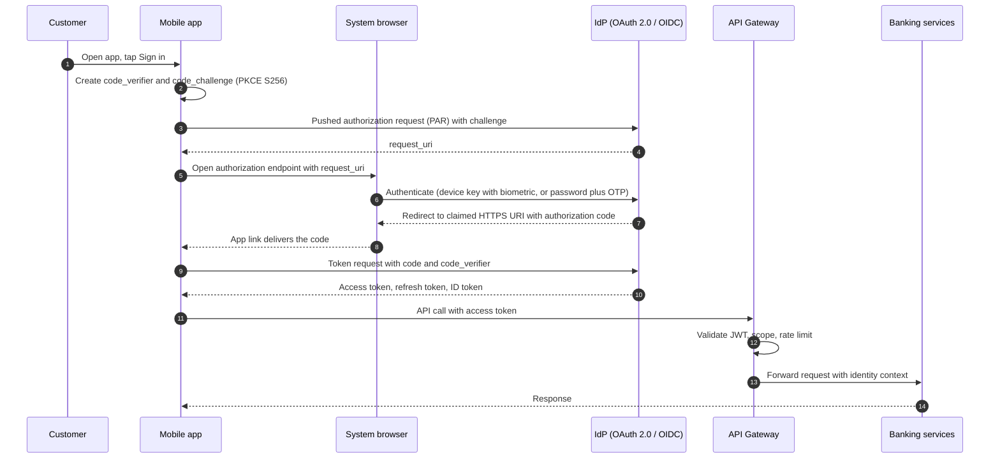
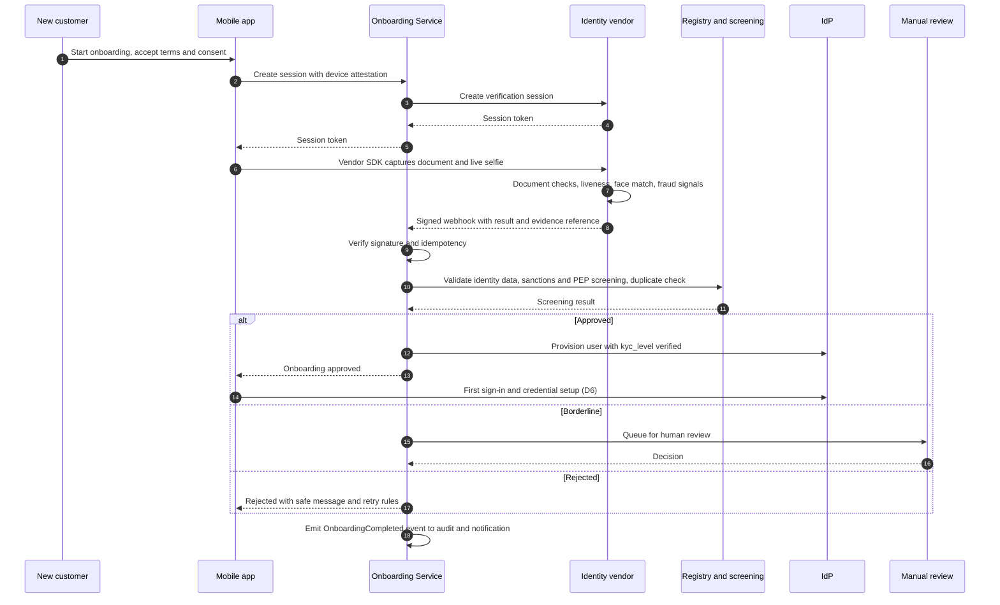
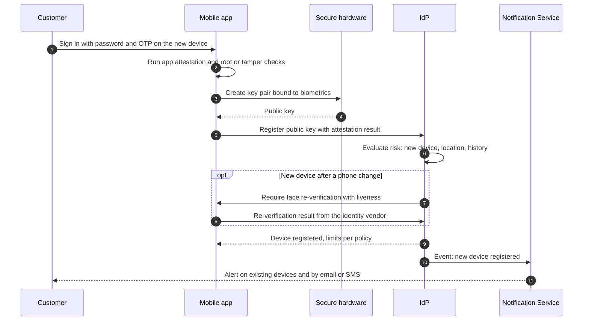

# Decision Register – BP Internet Banking

Status: **draft, Phase 1**. Format per decision: context, options evaluated, decision, justifications (2+), trade-offs accepted.
Covered: D1–D20 (all first drafts). Order follows [solution-plan.md](solution-plan.md).

---

## D1 – Cloud provider and regions

BP's banking system will run in Microsoft's cloud, in Texas, with an automatic standby site in Illinois. Ecuador has no cloud datacenter, so we measured the closest ones: about a tenth of a second away.

- *Business impact:* customers get the same speed even if the main site fails; there is no hardware to buy, and cost follows usage.
- *Decision needed from the business/legal side:* sending customer data abroad is allowed in Ecuador but needs customer consent, contracts and prior registration, so Legal must be involved early. This is the biggest non-technical risk of the design.

**Context.** The bank needs HA, DR, low latency, auto-healing and managed security services, with budget available.

**Options evaluated.** Azure, AWS, on-premises/private cloud.

**Decision.** **Azure**, with zone-redundant deployment in a primary region and a second region for DR. Ecuador has no Azure region, so the choice is driven by measured latency, availability-zone support and cross-border data-transfer law.

**Measured latency** (Azure Latency Test at azurespeed.com, median RTT, browser-based, from one network location in Ecuador, Sep 2026). Reproducible test link with the eight regions compared: [https://www.azurespeed.com/Azure/Latency?st_source=ai_mode®ions=brazilsouth,canadacentral,centralus,eastus,mexicocentral,northcentralus,southcentralus,westus](https://www.azurespeed.com/Azure/Latency?st_source=ai_mode&regions=brazilsouth,canadacentral,centralus,eastus,mexicocentral,northcentralus,southcentralus,westus)

| Region           | Location   | Median RTT                | Official Azure pair                        |
| ---------------- | ---------- | ------------------------- | ------------------------------------------ |
| South Central US | Texas      | **103 ms** (lowest) | North Central US                           |
| East US          | Virginia   | 104 ms                    | West US                                    |
| North Central US | Illinois   | 104 ms                    | South Central US                           |
| Canada Central   | Toronto    | 114 ms                    | Canada East                                |
| Central US       | Iowa       | 114 ms                    | East US 2                                  |
| Mexico Central   | Querétaro | 119 ms                    | none used here                             |
| West US          | California | 133 ms                    | East US                                    |
| Brazil South     | São Paulo | 181 ms                    | South Central US (Azure's documented pair) |

Three runs were made and they agree on the shape: the US and Canada regions cluster at roughly 103–120 ms (differences of a few ms are inside normal run-to-run noise), West US is about 30 ms slower, and Brazil South is 60–75 ms slower. East US 2 and Chile Central were not tested.

**Azure region pairs.** Azure pairs each region with another in the same geography, at least about 300 miles (480 km) apart, and provides paired-region benefits: geo-redundant storage replicates automatically to the pair, platform updates are rolled out to one region of a pair at a time, and one region of each pair is prioritized for recovery in a wide outage. Using an official pair for DR therefore means less custom replication work and less operational risk than an ad hoc combination.

**Decision: official pair South Central US (Texas) + North Central US (Illinois).**

| Role    | Region                                        | Why                                                                                                                                                        |
| ------- | --------------------------------------------- | ---------------------------------------------------------------------------------------------------------------------------------------------------------- |
| Primary | **South Central US (Texas)**            | Lowest median RTT (103 ms); availability zones; mature service coverage                                                                                    |
| DR      | **North Central US (Illinois)**         | 104 ms, so users see the same latency after a failover; about 1,300 km from Texas, enough separation for a regional disaster; official pair of the primary |
| Edge    | **Azure Front Door** points of presence | Terminates TLS near users, caches static SPA assets, applies WAF                                                                                           |

Why this pair over the alternatives:

1. **Latency on both legs.** Both regions are at 103–104 ms. The other official pair that includes a top-latency region, East US + West US, has a 133 ms DR leg, roughly 30 ms worse after a failover.
2. **Pairing benefits.** Automatic geo-redundant replication targets, sequenced platform updates and recovery prioritization, without the custom cross-region setup an unpaired choice such as Texas + Virginia would need.
3. **Separation.** Texas and Illinois are in different power grids and weather systems.

Trade-offs and points to verify: **North Central US has no availability-zone support** (confirmed on the Microsoft Learn Azure regions list: availability-zone support is marked "coming soon"). Consequences and how the design handles them:

1. **The primary is zone-redundant, the DR site is not.** South Central US runs across three zones, so a single datacenter failure never triggers a regional failover. The DR region is only used when the whole primary region is lost, so it is sized and configured as a warm standby: multiple instances spread over fault domains (availability sets / AKS node pools across fault domains) to survive rack and host failures, but not a full datacenter loss inside that region.
2. **DR posture.** Active-passive with continuously replicated data, infrastructure defined as code so the DR environment can be scaled up quickly at failover, and regular failover drills. The residual risk (a datacenter failure inside the DR region *while* running production from it) is accepted because it requires two independent large failures at once; it is stated in the risk section of the PDF.
3. **Service availability.** Checked against Azure's "Products available by region": API Management Premium, Service Bus Premium, Azure Cache for Redis, Key Vault Managed HSM and Azure SQL Database (including ledger tables) are available in both South Central US and North Central US. Still to confirm in the design phase: that the specific SKUs used support geo-replication or failover groups between the two regions, and availability of AKS features and Front Door origins.

Fallback if the risk in point 2 is judged unacceptable or a required service is missing from North Central US: use **East US (104 ms)** as DR, which has availability zones and full service parity, with geo-replication configured explicitly instead of relying on pair defaults; the cost is the loss of automatic paired-region benefits.

Regions rejected or held in reserve:

- **East US + West US pair:** West US measured 133 ms, so the pair's DR leg is noticeably slower.
- **Brazil South:** 181 ms; only justified if law required South American hosting.
- **Mexico Central:** 119 ms, not better than the US regions; hold as an alternative if a Latin American location is preferred.
- **Canada Central and Central US:** 114 ms, acceptable but no advantage over the chosen pair.
- **Chile Central and East US 2:** not measured.

**Data residency and legal position** (summary supplied by the project owner; not legal advice and to be confirmed with BP's legal and compliance teams before submission).

- Ecuador does **not** impose absolute data localization, so hosting outside the country is allowed, but it is a cross-border transfer under the personal data protection law (LOPDP) and is tightly regulated.
- LOPDP conditions for the transfer: destination with an adequate level of protection, or approved standard contractual clauses; explicit, informed client consent (except where the transfer is strictly necessary for the banking operation); and prior registration of the transfer with the national personal-data protection register, under the Superintendencia de Protección de Datos Personales (SPDP).
- Banking rules: the Código Orgánico Monetario y Financiero and Junta de Política y Regulación Financiera resolutions (the earlier reference to a specific cloud resolution numbered JPRF-2025-0155 could not be confirmed and is not used; the framework is the JPRF Codificación de Resoluciones Monetarias, Financieras, de Valores y Seguros together with the Superintendencia de Bancos operational-risk norm, Resolución SB-2021-2126) require the bank to audit and manage third-party cloud providers and cloud risk and to guarantee information integrity; cybersecurity obligations under the Ley Orgánica para el Fortalecimiento de la Ciberseguridad (reported as published in Registro Oficial, Quinto Suplemento No. 290, on 22 May 2026; confirm on the official source); penalties up to roughly 0.7–1% of prior-year turnover.
- Architectural consequences: a US destination needs contractual clauses and consent, so the design includes (a) data classification and minimization, keeping only what the service needs in the foreign region, (b) encryption with **customer-managed keys** (Key Vault Managed HSM) so the bank controls access, (c) supplier-risk artifacts (provider audit reports such as SOC 2 and ISO 27001, exit plan), and (d) an audit trail of every cross-border transfer. Compliance mapping continues in D19.
- If BP's legal team concludes that certain data classes cannot leave the country, the fallback is a hybrid design: that data stays in an Ecuadorian data center or colocation facility connected by ExpressRoute, and stateless services run in Azure.

Still to verify: confirm the legal references above on official sources, and repeat the latency test from the bank's actual ISPs and mobile carriers at different times of day.

Latency mitigations (a ~103 ms floor makes chatty APIs expensive): SPA static assets served from the CDN edge, Redis cache for frequent-client reads (D12), response aggregation in the BFF so a screen needs one round trip instead of several, HTTP/2 or HTTP/3 with connection reuse, and keeping the Core integration in the same region as the API layer.

**Justifications.**

1. **Identity fit.** Entra ID/Entra External ID, Key Vault and Azure Policy integrate natively with the OAuth 2.0 IdP requirement and with conditional access, reducing custom security code.
2. **Managed building blocks for every requirement.** AKS (auto-healing, autoscaling), API Management (gateway), Service Bus (reliable messaging), Azure Cache for Redis, zone-redundant databases, Azure Monitor/App Insights, Front Door + WAF, Defender for Cloud. Fewer components to operate means better operational excellence.
3. **Documented DR model.** Zone redundancy inside the primary region plus geo-replication to the paired region (equal latency) gives a clear path to RPO/RTO targets without user-visible degradation.
4. **Compliance tooling.** Azure Policy and Defender for Cloud regulatory-compliance dashboards (PCI DSS, ISO 27001) help evidence controls to auditors.

**Trade-offs.** Higher latency than an in-country deployment and a possible data-residency constraint (see above). Vendor lock-in on some managed services (mitigated by keeping business logic in containers and using open protocols: OAuth 2.0/OIDC, AMQP, OpenTelemetry). AWS would be an equally valid choice; the architecture uses generic patterns that map one-to-one.

---

## D2 – SPA framework and web architecture

The website is built with an enterprise-grade framework that gives every team the same structure, and the customer's login secrets are kept on the bank's servers, not in the browser.

- *Business impact:* consistent code across teams (easier reviews, onboarding and handover), a predictable release and support calendar, fast pages, and the main web fraud technique (stealing a session from the browser) is closed off.
- *Cost of the choice:* one more small server component to run (the BFF), in exchange for that security and for fewer calls per screen.

**Context.** The web channel is a Single Page Application for customers to view movements and make transfers and payments. It must be secure (financial data; session theft is the main threat), fast over a ~100 ms network floor (D1), maintainable by several teams over many years, and consistent in behavior with the mobile app. The project's working notes already list **Angular** as the web stack and **Flutter** as the mobile stack, and this decision confirms and justifies that choice.

**Options evaluated.**

| Option                          | Pros                                                                                                                                                                                                                                                                                                                                    | Cons                                                                                                                                                                 |
| ------------------------------- | --------------------------------------------------------------------------------------------------------------------------------------------------------------------------------------------------------------------------------------------------------------------------------------------------------------------------------------- | -------------------------------------------------------------------------------------------------------------------------------------------------------------------- |
| **Angular** (TypeScript)  | Complete, opinionated framework (routing, forms, HTTP client, dependency injection, testing, build) so all teams follow one structure; built-in XSS protection, CSP nonce support and XSRF helpers; strict typing end to end; predictable release cadence with long-term support; strong fit for large, long-lived enterprise codebases | Steeper learning curve (RxJS, DI); heavier default bundle (mitigated below); smaller ecosystem than React                                                            |
| React (TypeScript)              | Largest ecosystem and hiring pool; flexible                                                                                                                                                                                                                                                                                             | Unopinionated: every team must choose and enforce conventions for state, routing and data fetching, which fragments large codebases; more third-party choices to vet |
| Vue                             | Gentle learning curve                                                                                                                                                                                                                                                                                                                   | Smaller enterprise and banking ecosystem and hiring pool                                                                                                             |
| Server-rendered (Next.js / MPA) | Better first paint, SEO                                                                                                                                                                                                                                                                                                                 | SEO is irrelevant behind a login; server-side rendering adds a runtime to secure and scale; the exercise asks for an SPA                                             |

**Decision.** **Angular + TypeScript** (standalone components, strict mode, AOT compilation), served as static assets from **Azure Front Door (CDN + WAF) backed by Azure Storage static website / Static Web Apps**, talking to a **Backend-for-Frontend (BFF)** for the web channel.

**Justifications.**

1. **One enforced structure across teams.** Angular ships routing, forms, HTTP, dependency injection and testing as one supported platform, so conventions come from the framework instead of team discipline. For a bank with several squads and a long product life, this makes code review, onboarding and the technical roadmap easier to govern than a flexible library.
2. **Security features built in.** Templates escape output by default against XSS, sanitization is enforced unless the developer explicitly bypasses it (which can be banned by a lint rule), the framework supports CSP nonces, and the HTTP client has XSRF support. A published, predictable release and long-term-support schedule makes patching and dependency policy easier to plan and to show to auditors.
3. **Token safety through the BFF.** The BFF completes the Authorization Code + PKCE exchange (D4) and keeps tokens server-side; the browser holds only an HttpOnly, Secure, SameSite=Strict session cookie. This follows current IETF guidance for browser-based apps and removes the main SPA risk, token theft through XSS. The BFF also aggregates several service calls into one response per screen (fewer round trips over a ~100 ms link) and hides the internal service topology from the browser.
4. **Composable and lazy-loaded.** Feature areas (accounts, movements, transfers, profile and security, onboarding status) are lazy-loaded routes with public interfaces, which gives clear responsibility boundaries, keeps the first download small, and allows a later move to micro-frontends without a rewrite.
5. **Static delivery is cheap, scalable and resilient.** Static assets on a CDN scale without servers, have no runtime to patch, and survive origin outages from the edge cache, which fits the HA and cost criteria.

**Web architecture inside the SPA.**

- **Structure:** feature folders with standalone components; smart (container) and presentational components separated; a typed API client generated from the OpenAPI contract, so the UI never builds URLs or handles tokens; HTTP interceptors add the correlation ID, map errors and trigger step-up prompts when the API answers that a higher assurance level is needed (D6).
- **State:** server state through services with caching and invalidation after a transfer, feature-level state with signals or NgRx where complex; no financial data persisted in `localStorage`.
- **Performance budget:** lazy routes, deferrable views, the esbuild-based build with tree-shaking, compressed assets, HTTP/2 or HTTP/3, and CI checks on bundle size.
- **Security controls:** strict Content Security Policy with nonces (no inline scripts), Subresource Integrity, `frame-ancestors` against clickjacking, dependency scanning and lockfile pinning against supply-chain attacks, CSRF protection via SameSite cookies plus an anti-forgery header on state-changing calls, session idle timeout, re-authentication (step-up, D4/D6) before sensitive actions, and a lint rule that forbids bypassing Angular's sanitization.
- **Quality and operations:** unit and component tests, end-to-end tests of the transfer flow, accessibility checks (WCAG), real-user monitoring and client-side error reporting to Azure Monitor / Application Insights (D17), feature flags for gradual rollout, and CI/CD with blue-green deployment and instant rollback of static assets.

**Relationship to other decisions.** The BFF is a container in the C4 model, sitting in front of the API Gateway (D7); the mobile app (D3) authenticates directly against the IdP with PKCE and calls the gateway with its own token, so each client has the token model that suits it. Shared contracts (OpenAPI, design tokens) keep web and mobile consistent even though they use different frameworks (Angular and Flutter).

**Trade-offs accepted.** One extra hop and one more component to operate and secure (the BFF). Angular is heavier and has a steeper learning curve than lighter libraries, which is mitigated by lazy loading, the modern build pipeline and team training. The React ecosystem is larger, but for this scope the built-in structure and security defaults matter more than ecosystem size. Web and mobile do not share UI code (Angular vs Flutter); accepted because code sharing between a browser SPA and a native app is limited in practice, and shared contracts already give consistency.

---

## D3 – Mobile framework (2 options compared) and mobile architecture

One mobile app code base produces both the iPhone and the Android app, so a new feature reaches both groups of customers at the same time.

- *Business impact:* roughly half the development and testing effort of two separate apps, one release calendar, a consistent experience, and the ability to force an update if a security problem is found.
- *Risk to know about:* fewer developers know Flutter than React Native, so hiring and onboarding need planning; React Native is the documented alternative if the team prefers it.

**Context.** The exercise asks for a mobile app in a cross-platform framework, naming two options and justifying the choice. The app carries the most sensitive flows (onboarding with facial recognition, biometric login, transfers), so security, camera and biometric integration weigh more than in a typical consumer app.

**Options evaluated (two cross-platform frameworks required, native as reference).**

| Criterion                                                           | **Flutter** (Dart)                                          | **React Native** (TypeScript)                                                          | Native (Kotlin + Swift)     |
| ------------------------------------------------------------------- | ----------------------------------------------------------------- | -------------------------------------------------------------------------------------------- | --------------------------- |
| Rendering and consistency                                           | Own rendering engine: identical UI and behavior on both platforms | Uses native widgets: platform look, small differences between platforms                      | Best fidelity per platform  |
| Performance for data-heavy screens                                  | Compiled to native code, no JavaScript bridge                     | Good with the new architecture; JavaScript runtime and bridge/JSI in the path                | Best                        |
| Security tooling (secure storage, pinning, biometrics, attestation) | Mature plugins; platform channels for anything custom             | Mature libraries; native modules for anything custom                                         | Direct access to everything |
| Identity-verification SDKs (D5)                                     | Vendors provide Flutter SDKs or wrappers (to verify per vendor)   | Vendors commonly provide React Native SDKs (to verify per vendor)                            | Always available            |
| Talent and shared skills                                            | Smaller Dart pool; no code shared with the Angular SPA            | Larger JavaScript/TypeScript pool; TypeScript skills partly shared with the Angular SPA (D2) | Two specialist teams        |
| Cost and speed                                                      | One code base, one team                                           | One code base, one team                                                                      | Roughly double              |
| Long-term risk                                                      | Backed mainly by one vendor; strong momentum                      | Backed by Meta and a large community; more dependency churn                                  | Lowest platform risk        |

**Decision.** **Flutter**; **React Native** is the documented runner-up.

**Justifications.**

1. **Consistent behavior and predictable performance.** Flutter draws its own UI with a compiled engine, so the app behaves identically on iOS and Android and long movement lists and animations stay smooth without a JavaScript bridge. For a bank this reduces the "works on one platform only" defects and the QA matrix.
2. **Security and device integration.** Mature support for secure storage (Keychain, Keystore), local biometrics, certificate pinning, root and jailbreak detection, code obfuscation and platform attestation, with platform channels available to call the native APIs directly when a plugin is not enough.
3. **Single code base and cadence.** One team, one backlog and one release calendar keep feature parity and lower cost, which matters when regulatory changes must reach every customer at once.
4. **Fit with the rest of the design.** The app talks to the same OpenAPI-described gateway as the web (D7), so an API client is generated from the contract, and the app never contains business rules beyond presentation and validation.

**Why not React Native.** It is a strong option, especially if the team already writes JavaScript or TypeScript (skills and some logic sharing with the Angular SPA of D2). The trade-offs here are more dependence on native modules and the JavaScript runtime for camera, biometric and security features, and a bigger surface of third-party libraries to vet. It becomes the better choice if BP's team is JavaScript-heavy and the chosen identity vendor has stronger React Native support. **Why not native.** Best platform fidelity, but two teams and two code bases roughly double the cost and slow feature parity.

### Mobile application architecture

- **Layers (Clean Architecture):** *presentation* (screens and widgets, state management with BLoC or Riverpod), *domain* (use cases, entities, pure Dart, no framework), *data* (repositories, remote API client, secure local storage). Dependencies point inward, so business logic is testable without a device.
- **Feature modules:** onboarding, authentication, accounts and movements, transfers and payments, notifications inbox, security and devices, settings. Each module exposes a small public interface, which allows separate teams and lazy loading.
- **Networking:** one API client generated from the OpenAPI contract; TLS 1.2+ with **certificate pinning** (pin set with a backup pin and a rotation procedure); automatic retry only on idempotent calls; every mutating call carries an `Idempotency-Key` (D10); correlation ID header on every request for tracing (D17).
- **Authentication module:** the AppAuth pattern with the system browser, PKCE and claimed HTTPS redirect URIs (D4); tokens stored only in Keychain / Keystore; the biometric-protected device key of D6 lives in the secure hardware.
- **Local data and offline behavior:** the app is **online-first**. It keeps an encrypted cache (SQLCipher-class encrypted database, key in Keystore/Keychain) of the last movements and balances so the customer can still read recent history with a visible "last updated" mark; **money-moving actions require connectivity and a fresh server state** and are never queued offline. The cache is wiped on logout, on device-key invalidation and after repeated failed unlock attempts.
- **Notifications and deep links:** in the first stages alerts arrive by SMS and email (D14), so the app needs no push infrastructure. Links inside those messages carry only an event reference, not amounts or account numbers, and open the app, which loads the details after authentication. Push notifications can be added later with the same rules.
- **App protection (see D16):** root/jailbreak and debugger detection, tamper detection, **app attestation** (Play Integrity on Android, App Attest on iOS) checked by the backend for sensitive operations such as onboarding and device enrollment, code obfuscation (`--obfuscate` with split debug info), screenshot and screen-recording protection on sensitive screens, hidden app-switcher preview, clipboard protection, and no sensitive data in logs.
- **Delivery and operations:** CI/CD with automated tests and signed builds, **staged rollout** by percentage, **remote feature flags and kill switches**, a **minimum-supported-version check** that forces an update when a vulnerability is found, crash and performance reporting (D17), and privacy-respecting analytics with consent.
- **Quality:** unit tests for domain and data layers, widget and golden tests, integration tests for the login, onboarding and transfer flows on a device farm, accessibility checks (screen readers, contrast, dynamic type), performance budgets (cold start, frame time) tracked in CI.

**Trade-offs.** Dart is a smaller talent pool and some vendor SDKs may come as wrappers, so **verify the chosen identity vendor's official Flutter support before committing** (fallback: React Native, or a thin native module wrapping the vendor's native SDK). The Flutter engine adds to the app size. Pinning needs a disciplined rotation process, or a certificate change can lock users out.

---

## D4 – Authentication flow (OAuth 2.0 / OpenID Connect)

Customers log in on the bank's own login service; the app never sees or stores the password.

- *Business impact:* stronger security rules (extra verification, risk checks) can be changed in one place without releasing new apps; lower fraud and account-takeover risk; the same login for web and mobile.
- *Trade-off:* the customer is briefly taken to a login screen and back, a small UX cost we accept for security.

**Context.** The company already owns a product that implements OAuth 2.0 and can be configured for this purpose, so BP does not build an authorization server. The task here is to choose and configure the right flow for each client and to define the token model. The mobile app is a **public client** (it cannot keep a secret). The web channel uses a BFF (D2), which is a **confidential client** (it can).

**Options evaluated.**

| Flow                                | Verdict                 | Reason                                                                                                           |
| ----------------------------------- | ----------------------- | ---------------------------------------------------------------------------------------------------------------- |
| **Authorization Code + PKCE** | **Chosen**        | Current best practice for browser and mobile clients; protects against authorization-code interception           |
| Implicit                            | Rejected                | Tokens exposed in the URL and browser history; deprecated by the OAuth 2.0 Security BCP and removed in OAuth 2.1 |
| Resource Owner Password Credentials | Rejected                | The app handles the password directly, which defeats MFA, risk checks and phishing resistance; deprecated        |
| Client Credentials                  | Service-to-service only | No user involved; used between backend services or jobs                                                          |
| Device Authorization Grant          | Not needed              | For input-constrained devices such as TVs                                                                        |

**Decision.** **Authorization Code Flow with PKCE (S256)** with OpenID Connect for identity, applied as follows:

| Client                         | Type                | Details                                                                                                                                                                                                                                                                                                   |
| ------------------------------ | ------------------- | --------------------------------------------------------------------------------------------------------------------------------------------------------------------------------------------------------------------------------------------------------------------------------------------------------- |
| **Mobile app** (Flutter) | Public client       | AppAuth pattern; system browser (ASWebAuthenticationSession on iOS, Custom Tabs on Android), never an embedded WebView;**claimed HTTPS redirect URIs** (universal links / app links), not custom URL schemes; PKCE S256; tokens in Keychain / Keystore; refresh-token rotation with reuse detection |
| **Web SPA via BFF**      | Confidential client | The BFF runs the code exchange (PKCE plus client authentication such as`private_key_jwt`), keeps tokens server-side, and gives the browser an HttpOnly, Secure, SameSite session cookie (D2)                                                                                                            |
| **Backend services**     | Machine identity    | Managed identity or Client Credentials; mTLS between services (D16)                                                                                                                                                                                                                                       |

**Financial-grade hardening (recommended profile).** Follow the **FAPI 2.0 (Financial-grade API) security profile** where the IdP supports it: **Pushed Authorization Requests (PAR)** so request parameters travel over a back channel, `iss` parameter checks against mix-up attacks, **sender-constrained access tokens (DPoP or mTLS)** for high-risk scopes, and short-lived tokens. Where the IdP does not yet support a feature, list it as a recommendation with the compensating control.

**Token model.**

| Item            | Recommendation                                                                                                                                                                                        |
| --------------- | ----------------------------------------------------------------------------------------------------------------------------------------------------------------------------------------------------- |
| Access token    | JWT, 5–10 minutes, audience per API, scopes such as`accounts:read`, `movements:read`, `transfers:create`; validated at the gateway (signature by cached JWKS, issuer, audience, expiry, scope) |
| Refresh token   | Rotating, single use, reuse triggers revocation of the whole family; bound to the device; idle and absolute lifetime set by policy (for example 30 days idle for mobile, shorter for web sessions)    |
| ID token        | Used by the client only to know who logged in; never sent to APIs                                                                                                                                     |
| Assurance level | `acr` / `amr` claims record how the user authenticated (password, biometric-unlocked device key, OTP); the API demands a higher `acr` for sensitive operations (step-up, D6)                    |
| Session control | Central logout and revocation; the IdP can end all sessions of a customer after suspicious activity, a password change or a device removal                                                            |
| Consent         | First-party apps, so no consent screen per login; scopes are still enforced per API                                                                                                                   |

**Login sequence (mobile).**

**Justifications.**

1. **Standards direction.** Implicit and password grants are deprecated in the OAuth 2.0 Security Best Current Practice and removed in OAuth 2.1; PKCE is required for public clients and defends against authorization-code interception, and the FAPI profile is the recognized reference for financial APIs.
2. **Credentials never touch the app.** The user authenticates at the IdP through the system browser, so MFA, risk checks, biometrics and future methods (passkeys) are centralized and can change without app releases, and phishing-resistant methods can be added without touching the apps.
3. **Small blast radius for stolen tokens.** Short-lived access tokens, rotating refresh tokens with reuse detection, device binding and sender-constrained tokens limit what an attacker gets from a stolen token; the gateway validates every call (D7).
4. **Same identity for every channel.** One IdP, one token format and one set of scopes serve web, mobile and future channels, and every authentication event is available to the audit design (D11).

**Trade-offs.** The redirect-based experience is slightly heavier than a native login form (mitigated by the biometric device-key login, D6); FAPI features depend on the company's IdP product, which must be checked (open assumption); key rotation and JWKS caching need operational care.

---

## D5 – Onboarding with facial recognition

A new customer opens an account from the phone with an ID photo and a live selfie; a specialist company checks that the person is real and matches the document.

- *Business impact:* account opening in minutes without a branch visit, and the identity evidence regulators expect for anti-money-laundering rules. Cost is per verification, so it scales with new customers.
- *Risks to manage:* face data is sensitive personal data (explicit consent, minimal retention), and we depend on an outside vendor, which is why the design lets BP switch vendor and adds a manual-review path for doubtful cases.
- *Decisions for the business:* approval thresholds (how strict), what a new customer may do in the first days (initial limits), and what happens when verification fails.

**Context.** New customers onboard in the mobile app with facial recognition, and this must be part of the authorization and authentication flow (exercise statement). The account holder must be a real, unique person who matches the identity document before any credentials or tokens are issued.

**Options evaluated.**

| Option                                                                                 | Pros                                                                                                                               | Cons                                                                                                                                                              |
| -------------------------------------------------------------------------------------- | ---------------------------------------------------------------------------------------------------------------------------------- | ----------------------------------------------------------------------------------------------------------------------------------------------------------------- |
| **SaaS identity verification** (Jumio, Onfido (now part of Entrust), or similar) | Document scan, liveness and fraud signals in one SDK; the vendor keeps up with deepfake and injection attacks; certified processes | Per-verification cost; biometric data handled by a third party (residency, contracts)                                                                             |
| Cloud-native (Azure AI Face, AWS Rekognition)                                          | Same cloud, lower per-call cost, data stays in BP's tenant                                                                         | Face matching only: document verification, fraud logic and injection defence must be built; some Azure Face capabilities require Limited Access approval (verify) |
| In-house machine learning                                                              | Full control                                                                                                                       | Highest cost and risk; hard to certify liveness against attacks                                                                                                   |

**Decision.** A **SaaS verification vendor behind an anti-corruption adapter**, orchestrated by a dedicated **Onboarding Service**. The vendor is swappable and a second provider (or a cloud-native one) can act as a fallback. **No vendor is named as final in the PDF**: the decision is the pattern, with candidates listed and the selection criteria (accuracy, liveness certification such as ISO 30107-3 presentation-attack testing, Latin American ID coverage including Ecuadorian documents, Flutter SDK, data residency, price).

**How facial recognition fits the authorization and authentication flow.**

1. **Identity proofing gate (onboarding).** The person is proven real and matching before the account and credentials exist; only then does the IdP hold a user with a verified-identity attribute (`kyc_level=verified`).
2. **Step-up and recovery (later).** Face re-verification (liveness plus comparison with the onboarding reference or the document photo, per vendor capability) is required for account recovery, new-device enrollment after a lost phone, and unusually high-risk events (D6). It is not used on every login.

**Onboarding sequence.**

**Onboarding states.** `STARTED` → `DOCUMENT_CAPTURED` → `LIVENESS_PASSED` → `SCREENING` → (`APPROVED` | `UNDER_REVIEW` | `REJECTED` | `EXPIRED`) → `CREDENTIALS_SET` → `ACTIVE`. Sessions expire after a short time, retries are limited, and every state change is an audit event (D11).

**Controls specific to onboarding.**

- **Consent and transparency** before capture: purpose, retention, vendor, and rights (LOPDP), recorded as evidence.
- **Device attestation** (D3) before starting, to block emulators and tampered apps; liveness with **injection-attack detection**, not only presentation-attack detection.
- **Vendor webhooks are authenticated** (signature, timestamp, idempotency) and never trusted from the app; results are pulled from the vendor if a webhook is lost.
- **Identity-document and civil-registry validation** (from the project notes): the customer enters the national ID (cédula) data and captures the document; the live selfie is compared with the **photograph on the cédula** and with the **reference biometric data obtained from an external service** (the national civil registry's identity/biometric validation service, contracted or accessed through an authorized provider; to confirm access and terms); and the **fingerprint code (código dactilar)** is verified by capturing the fingerprint and comparing it with the code entered. These checks are added as steps of the verification, performed by the vendor or by the registry adapter.
- **AML and compliance checks** (from the project notes): KYC data completeness, sanctions and politically-exposed-person screening, a **uniqueness check** so one person cannot open multiple identities, and the compliance rules of D19 run before approval.
- **Regulatory acceptance:** the customer must read and accept the mandatory regulatory terms and privacy notices (recorded as evidence) before the account is activated.
- **Risk-based decisions**: confident approvals are automatic, borderline cases go to a **manual review queue** with an SLA, and rejections give safe messages that do not reveal how to defeat the checks.
- **New-customer limits**: reduced transfer limits and a cooling period for new beneficiaries during the first days.
- **Resilience**: if the vendor is unavailable, sessions are queued or the customer is offered a retry, and the fallback provider takes over; the adapter isolates the change (D8).

**Justifications.**

1. **Regulatory.** Remote KYC and AML identity proofing needs document plus liveness evidence and an audit trail; a specialized vendor provides this with its certifications, and the flow keeps an immutable record (D11).
2. **Attack resistance.** Liveness and injection-attack detection evolve quickly and need continuous investment; buying is safer and cheaper than building, and the vendor carries the operational burden.
3. **Decoupling.** The adapter and the Onboarding Service keep vendor details out of the IdP and the banking services, so the vendor can be changed without touching authentication.
4. **Security root of trust.** Credentials, device keys and tokens are only issued after the person is proven real, so every later method of login (D6) is tied to a verified human, which lowers account-takeover and synthetic-identity fraud.

**Data protection.** Biometrics are sensitive personal data under Ecuador's personal data protection law (LOPDP): explicit consent, minimization (BP stores the verdict, scores and an evidence reference; raw images and templates stay with the vendor for the shortest legally required period or are deleted), encryption, defined retention, contractual limits on vendor reuse of the data, and a check of cross-border transfer rules, since most vendors process data outside Ecuador (D19). Confirm with legal counsel.

**Trade-offs.** Cost per verification and dependence on a vendor, mitigated by the adapter, a fallback provider and a manual-review path. Stricter thresholds reduce fraud but reject more genuine customers; the thresholds are a product decision tuned with real data.

---

## D6 – Post-onboarding login methods and step-up authentication

After onboarding, customers unlock the app with their fingerprint or face on the phone; the fingerprint itself never leaves the phone. For more sensitive actions the app asks for an extra confirmation.

- *Business impact:* quick daily access, fewer "forgot password" support calls, and a stronger defence against phishing than passwords alone.
- *Decisions for the business:* the amounts and actions that need extra confirmation, and what happens when a customer loses or changes phone. That flow (re-verification with a selfie, lower limits after a device change) is a product decision as much as a technical one.

**Options evaluated.**

| Method                                                                                            | Verdict                           | Reason                                                                                                                                                                  |
| ------------------------------------------------------------------------------------------------- | --------------------------------- | ----------------------------------------------------------------------------------------------------------------------------------------------------------------------- |
| Username + password + OTP (TOTP or in-app approval)                                               | **Fallback and web**        | Universal, but passwords are phishable; SMS-only OTP is weak against SIM swap, so app-based OTP (TOTP) or approval inside the app is preferred, with SMS as last resort |
| **Device biometrics unlocking a device-bound key (passkey / FIDO2 platform authenticator)** | **Primary on mobile**       | Phishing-resistant, fast, no shared secret; the biometric never leaves the device                                                                                       |
| Passkeys for the web (WebAuthn)                                                                   | **Target for web**          | Same benefits; adopted as browsers and the IdP allow                                                                                                                    |
| Facial recognition on every login                                                                 | Rejected                          | Cost per check, latency, friction, privacy exposure and spoofing risk; kept for recovery and high-risk events only                                                      |
| Hardware token                                                                                    | Optional for high-value customers | Strong but costly to distribute                                                                                                                                         |

**Decision.**

- **Enrollment** (right after onboarding, and for every new device): the customer sets a password and a recovery factor, then the app generates a **key pair inside the secure hardware** (Secure Enclave on iOS, Keystore / StrongBox on Android) with the key **bound to biometric authentication**; the public key and the app-attestation result are registered with the IdP as an authenticator for that device.
- **Daily login:** the IdP sends a challenge; the app signs it after the fingerprint or face check on the phone; the IdP verifies the signature against the registered public key and issues tokens (D4). This is the **passkey pattern (FIDO2)**: possession (the device key) plus inherence (the biometric), and it stays phishing-resistant.
- **Fallback:** password plus app-based OTP (TOTP) or approval inside the app, and SMS OTP only as a last resort with extra risk checks.
- **Recommended tooling:** the IdP's FIDO2/WebAuthn and adaptive-access capabilities, platform attestation services (Play Integrity, App Attest), and, if fraud volumes justify it, a device-intelligence and behavioral-biometrics service from the industry.

**Device enrollment and recovery sequence.**

**Step-up matrix (illustrative; amounts to be set by the business and risk team).**

| Action                                                                                  | Required assurance                                                                                                                        |
| --------------------------------------------------------------------------------------- | ----------------------------------------------------------------------------------------------------------------------------------------- |
| Open app, view balances and movements                                                   | Biometric-unlocked device key (or valid session)                                                                                          |
| Transfer between own accounts                                                           | Biometric-unlocked device key                                                                                                             |
| Transfer to a registered beneficiary below the threshold                                | Biometric-unlocked device key                                                                                                             |
| Transfer above the threshold, or to a**new beneficiary**, or payments of services | Device key**plus** a second confirmation (app-based OTP or approval inside the app), and a cooling-off period for new beneficiaries |
| Add or change a device, password, phone or email                                        | Password + OTP, and face re-verification for high-risk cases; alert to the customer                                                       |
| Account recovery or lost phone                                                          | Face re-verification with liveness plus registered contact confirmation; limits reduced for a cooling-off period                          |

The gateway and the services enforce the matrix through the `acr` claim (D4): an API refuses the call and asks the client to step up when the current assurance is too low.

**Session and device policy.** Short idle timeout in the app (for example a few minutes) with biometric re-unlock, absolute session limit, **device inventory** in the app (list, rename, revoke), automatic key invalidation when biometrics change (the biometric enrollment set changes) or the device fails integrity checks, remote revocation on report of a lost phone, and notifications for every new device and every sensitive action (D14).

**Justifications.**

1. **Biometrics stay on the device.** The fingerprint never leaves the phone; it only unlocks a private key whose public key is registered with the IdP, so there is no central store of biometrics to breach, and the login satisfies strong customer authentication (possession plus inherence).
2. **Phishing resistance.** FIDO2/passkeys bind the credential to the service and remove the shared secret that phishing steals; passwords can be retired over time, cutting account-takeover risk.
3. **User experience and support cost.** Fast daily login on mobile, fewer password resets, and stronger checks only when the risk justifies them (risk-based step-up).
4. **Consistent with onboarding.** Every method builds on the identity proven in D5, and facial re-verification is reserved for recovery and high-risk events, where it earns its cost.

**Trade-offs.** Device change and recovery flows are the hard part and the main fraud target; the design uses face re-verification (D5), notifications and cooling-off limits. Passkey and attestation support depends on the company's IdP product (open assumption); if a feature is missing, the fallback is the password plus app-based OTP flow with the compensating controls above. Users on very old devices without secure hardware get reduced limits.

---

## D7 – Integration layer: API Gateway and BFF

Every request from the web or the phone passes through one controlled entrance, like a bank lobby with a guard: it checks who the customer is, what they are allowed to do, slows down abusers, and only then sends the request to the right internal service.

- *Business impact:* one place to enforce security and limits, new services can be added behind it without changing the apps, and internal systems (Core) are never exposed to the internet.

**Context.** Clients must reach three mandatory services (basic data, movements, transfers) and more we add, while internal systems stay private. The exercise requires an integration layer with an API Gateway.

**Options evaluated.**

| Option                                                                 | Pros                                                                                                                                                  | Cons                                                                                                |
| ---------------------------------------------------------------------- | ----------------------------------------------------------------------------------------------------------------------------------------------------- | --------------------------------------------------------------------------------------------------- |
| **Azure API Management (Premium)** behind Azure Front Door + WAF | Managed, zone-redundant, multi-region, policies for JWT validation, throttling, versioning, transformation; developer portal; native Azure monitoring | Cost of the Premium tier; policy language to learn                                                  |
| Kong / self-managed gateway on AKS                                     | Portable, plugin ecosystem                                                                                                                            | We operate, patch and scale it ourselves; weaker fit for the HA and operational-excellence criteria |
| Azure Application Gateway only                                         | Cheap L7 load balancer + WAF                                                                                                                          | No API management (per-consumer throttling, versioning, JWT policies)                               |
| No gateway (clients call services directly)                            | Fewer hops                                                                                                                                            | Exposes services, duplicates security logic in every service                                        |

**Decision.**

- **Path for mobile:** app → Azure Front Door (TLS, WAF, DDoS) → **API Management** → services.
- **Path for web:** browser → Front Door → **Web BFF** (token custody, D2) → **API Management** → services.
- The gateway validates the JWT (signature, issuer, audience, scope), applies rate limits per client and per customer, validates request schemas against the OpenAPI contract, adds a correlation ID, and routes by path and version (`/v1/...`). Backend services are only reachable from the gateway over a private network with mutual TLS.
- **Aggregation** of several calls into one response (a "customer overview" screen) is done in the Web BFF for the web, and by an **Aggregation API** (a composed read endpoint exposed by the gateway layer and backed by the Movements and Profile services) for mobile, so both channels make one round trip over the ~100 ms link.

**Justifications.**

1. **Single enforcement point (defence in depth).** Authentication, throttling, schema validation and WAF rules are applied once, consistently, before any business code runs; services still authorize by scope and customer identity (zero trust: never trust the network alone).
2. **Decoupling and evolution.** API versioning and routing let services be split, replaced or added without changing the clients, which meets the requirement of a decoupled architecture that accepts future components.
3. **Managed HA and lower operational load.** APIM Premium is zone-redundant and supports multi-region deployment, so the gateway is not a single point of failure, and we avoid running a gateway ourselves.

**Trade-offs.** Premium tier cost and one more hop (typically a few ms inside the region). APIM Premium multi-region and availability-zone support must be confirmed for South Central US and North Central US (D1 checks); if the DR region lacks it, the DR gateway is deployed as a secondary unit or Front Door routes to a warm standby.

---

## D8 – Service decomposition

The system is split into small services, each owning one business job (customer data, movements, transfers, notifications, audit). This lets teams work and release independently, and a problem in one area (say notifications) does not stop transfers.

- *Business impact:* faster delivery of new products, easier scaling of the busiest parts, and clearer ownership. The price is more moving parts to run and monitor.

**Context.** The exercise gives three mandatory services and invites more to improve performance or the information given to customers. Splitting too much creates distributed-system complexity; splitting too little creates a monolith.

**Options evaluated.** Modular monolith; coarse services (the 3 mandatory only); **fine-grained microservices by business capability**; serverless functions per action.

**Decision.** Microservices aligned to business capabilities (domain-driven bounded contexts), each with its own data store (D13):

| Service                                                         | Responsibility                                                                                                                                       | Type                      | Talks to                                             |
| --------------------------------------------------------------- | ---------------------------------------------------------------------------------------------------------------------------------------------------- | ------------------------- | ---------------------------------------------------- |
| **Customer Profile Service** (mandatory 1: basic data)    | Basic customer data and products from Core; detailed data from the complementary system on demand                                                    | Query                     | Core adapter, Detail adapter, cache                  |
| **Movements Service** (mandatory 2: movements)            | Movement history, filters, statements; serves from the read model, falls back to Core                                                                | Query (CQRS read side)    | Core adapter, Redis, read model                      |
| **Transfers & Payments Service** (mandatory 3: transfers) | Own-account and interbank transfers and payments; saga, limits, idempotency (D10)                                                                    | Command (CQRS write side) | Core adapter, interbank network adapter, Service Bus |
| **Notification Service** (added)                          | Sends customer notifications, as the regulation requires, via 2+ channels with fallback (D14)                                                        | Event consumer            | Service Bus, SMS and email providers                 |
| **Audit Service** (added)                                 | Records every customer action immutably (D11)                                                                                                        | Event consumer            | Service Bus, ledger store                            |
| **Frequent Client Service** (added)                       | Detects frequent customers from activity events and announces changes; the Movements and Profile services then keep those customers' data warm (D12) | Event consumer            | Service Bus, Redis (activity counters)               |
| **Onboarding Service** (D5)                               | Orchestrates identity verification and provisions the user in the IdP                                                                                | Command                   | Verification vendor adapter, IdP admin API           |
| **Risk / Limits Service** (added, can come later)         | Transaction limits and simple fraud rules before a transfer executes                                                                                 | Query                     | Transfers Service                                    |

**Integration adapters (anti-corruption layer).** The Core platform, the complementary customer-data system, the interbank payment network and the notification providers are each reached only through an adapter component that translates their protocols and models into BP's domain model, adds timeouts, retries and circuit breakers, and hides changes in the external system. The Core's protocol (REST, SOAP or MQ) is not specified in the exercise; the adapter makes that an implementation detail.

**Justifications.**

1. **Segmentation of responsibilities and independent scaling.** The read-heavy Movements and Profile services scale on demand without touching the transaction-critical Transfers service, and teams own services end to end. This maps directly to the grading criteria on segmentation and decoupling.
2. **Fault isolation.** A notification-provider outage or a slow complementary system cannot block a transfer, because they sit behind asynchronous events and circuit breakers; each service can fail and recover (auto-healing, D15) on its own.
3. **Reusability for future components.** New products (cards, loans, service payments) are added as new services that consume the same events and use the same gateway, identity and audit, without changing existing ones.

**Why not fewer or more services.** A modular monolith is simpler and legitimate for a small team, but it couples release cycles and scaling, and does not demonstrate the decoupling the exercise asks for. Function-per-action serverless adds cold starts and hard-to-trace flows for a latency-sensitive banking path.

**Trade-offs.** More components to deploy, secure, observe and version; distributed data consistency is harder (handled by D10); it requires platform maturity (CI/CD, tracing, D17). Mitigation: a common service template (health probes, tracing, logging, auth middleware) so services are cheap to add.

---

## D9 – Communication: synchronous vs asynchronous

When the customer is waiting for an answer (seeing a balance), services answer immediately. When something can happen a moment later (sending an SMS, writing the audit record), it goes through a reliable queue so nothing is lost even if a system is briefly down.

- *Business impact:* screens stay fast; notifications and audit never slow down or block a payment; messages survive outages.

**Options evaluated.**

| Concern                     | Options                                                                                     | Chosen                                                                         |
| --------------------------- | ------------------------------------------------------------------------------------------- | ------------------------------------------------------------------------------ |
| Client to gateway           | REST/JSON over HTTPS, GraphQL, gRPC-web                                                     | **REST/JSON (OpenAPI) over HTTPS, TLS 1.2+ (HTTP/2)**                    |
| Service to service (sync)   | REST, gRPC                                                                                  | **REST for most calls; gRPC allowed for high-throughput internal paths** |
| Events and commands (async) | Azure Service Bus (AMQP 1.0), Event Hubs (Kafka protocol), Event Grid, RabbitMQ self-hosted | **Azure Service Bus Premium (AMQP 1.0)** for domain events and commands  |

**Decision.** Synchronous request/response only where the caller needs the answer now (queries; the initial accept of a transfer). Everything else is **event-driven**: services publish domain events (`TransferRequested`, `TransferCompleted`, `TransferFailed`, `CustomerAccessed`) through the **transactional outbox** to Service Bus topics; consumers (Notification, Audit, Frequent Client, read-model updaters) subscribe independently with their own subscriptions, retries with backoff and dead-letter queues. Event Hubs is reserved for high-volume telemetry or analytics streams if needed later.

**Justifications.**

1. **Temporal decoupling and resilience.** Consumers can be down or slow without impacting producers; messages are persisted and redelivered (at-least-once), with dead-letter queues for poison messages, which supports fault tolerance and auto-healing.
2. **Right tool for banking workloads.** Service Bus gives ordering per session, duplicate detection, transactions, scheduled delivery and dead-lettering, which matter for financial flows, whereas Event Hubs is optimized for throughput, not per-message workflow semantics; a managed service also avoids operating RabbitMQ ourselves.
3. **Open, standard protocols.** AMQP 1.0 and HTTPS/REST keep the design portable and easy to secure (TLS everywhere, mTLS between services, tokens on every call).

**Trade-offs.** Eventual consistency between services and the need for idempotent consumers (duplicates are possible); harder end-to-end debugging (mitigated by correlation IDs and distributed tracing, D17). Service Bus Premium is zone-redundant and supports geo-disaster recovery; the classic geo-DR feature replicates namespace metadata, not queued messages, so in-flight messages after a regional failover are handled by the outbox and reconciliation (D10), or by the newer Premium geo-replication feature if it is available in the chosen regions (to verify).

---

## D10 – Transfer reliability (own-account and interbank)

A transfer touches several systems (the Core, possibly another bank). If something fails halfway, money must never be lost or duplicated. We design the transfer as a series of steps that can be safely retried or undone, and every request has a unique reference so a double tap never sends the money twice.

- *Business impact:* customer trust and no reconciliation nightmares; clear transfer statuses ("pending", "completed", "failed") that the app can show honestly; interbank transfers may take a moment, so the customer sees a status instead of a spinner.

**Context.** The Core and the interbank payment network are external and do not participate in a shared distributed transaction. Transfers must be safe against timeouts, retries and crashes.

**Options evaluated.** Two-phase commit (2PC/XA), **orchestrated saga**, choreographed saga, synchronous call with best-effort retry.

**Decision.** An **orchestrated saga** in the Transfers & Payments Service, with **idempotency keys**, the **transactional outbox**, and **reconciliation**:

1. The client sends the transfer with an `Idempotency-Key`; the gateway requires **step-up authentication** (D6) above a threshold or for a new beneficiary.
2. The service validates limits and beneficiary, stores the transfer as `PENDING` and writes a `TransferRequested` event in the same local database transaction (outbox), then returns `202 Accepted` with the transfer ID and a status URL.
3. The saga orchestrator executes the steps: reserve/debit the source account in the Core → for interbank, submit to the payment network → wait for confirmation or rejection (callback, polling or file) → mark `COMPLETED`.
4. On failure or timeout, **compensating actions** run (release the reservation or reverse the debit) and the state becomes `FAILED` or `REVERSED`; every step is retried with exponential backoff behind a circuit breaker, and unrecoverable cases go to a operaciones-manuales queue.
5. A scheduled **reconciliation job** compares BP's records with the Core and the network's settlement reports to detect and fix divergences.
6. Events (`TransferCompleted`, `TransferFailed`) drive notifications (D14), audit (D11) and read-model updates (D12).

**Own-account transfers** between a customer's own accounts inside the Core are short and can complete synchronously on the fast path; **interbank transfers** and payments are asynchronous by nature.

**Justifications.**

1. **2PC is not available and not desirable.** The Core and the external network do not support distributed transactions, and locking across systems reduces availability; the saga trades atomicity for availability with explicit compensations, which is the standard pattern for this situation.
2. **Idempotency and outbox give exactly-once effect on top of at-least-once delivery.** Idempotency keys make retries safe (no double payment), and the outbox removes the "database committed but event lost" gap, the classic dual-write failure.
3. **Operational safety net.** Reconciliation and a manual queue acknowledge that distributed failures still happen and give operations a controlled way to resolve them (operational excellence, audit needs).

**Why orchestrated rather than choreographed.** Money movement needs one place that knows the full state, timeouts and compensations, which makes it auditable and easier to reason about; choreography spreads the logic across services and is harder to trace for regulators.

**Trade-offs.** Eventual consistency in transfer status, more code than a simple call, and the need to model states and compensations carefully. The interbank network integration (in Ecuador, the central bank's interbank payment system or whatever mechanism BP already uses; to be confirmed) is modeled as an adapter, since its protocol is not specified.

---

## D11 – Audit design

Every action a customer takes is recorded in a way that nobody can alter afterwards, not even administrators. When a regulator, a fraud team or a customer dispute asks "what happened and when", there is a trustworthy answer.

- *Business impact:* regulatory evidence, faster dispute resolution, forensic capability after incidents. Audit never slows the customer down because it is written asynchronously.
- *Decisions for the business and legal side:* how long audit records must be kept, and how privacy rights under the personal-data law interact with keeping them.

**Context.** The exercise states that the system has an audit database that records all client actions. It must be immutable, complete and queryable, without hurting the transaction path.

**Options evaluated.**

| Option                                                               | Pros                                                         | Cons                                                                                                             |
| -------------------------------------------------------------------- | ------------------------------------------------------------ | ---------------------------------------------------------------------------------------------------------------- |
| Full Event Sourcing for the whole system                             | Complete history by construction; time travel                | High complexity, event versioning, replay cost; the Core, not our services, is the system of record for balances |
| **Outbox events → Audit Service → append-only ledger store** | Simple, decoupled, no impact on transactions, tamper-evident | Audit is eventually consistent (seconds of delay)                                                                |
| Application logs as audit                                            | Trivial                                                      | Not immutable, not structured, easy to lose or alter                                                             |
| Change Data Capture on each database                                 | No app code                                                  | Records data changes, not customer intent or actions; couples audit to schemas                                   |

**Decision.** Every service emits **audit events** (who, what, when, from which channel/device/IP, result, correlation ID) through the **transactional outbox** to a Service Bus topic. The **Audit Service** consumes them, validates the schema, and writes them to:

1. **Azure SQL Database ledger tables** (append-only, cryptographically verifiable history) for queryable, tamper-evident storage of the recent period (hot); and
2. **Azure Blob Storage with an immutable (WORM) retention policy** for long-term archive, with periodic hash digests stored separately so tampering can be detected.

Audit data access is read-only, restricted by role, itself audited, and separated from operational teams. Sensitive fields are minimized or tokenized in the audit record to reconcile immutability with personal-data rules; retention periods come from the compliance mapping (D19).

**Justifications.**

1. **Immutability with proportionate complexity.** Ledger tables and WORM storage give tamper evidence and regulatory-grade immutability without adopting Event Sourcing across the whole system, which would add complexity for little gain because the Core is the source of truth for balances.
2. **Decoupling and zero impact on latency.** Asynchronous capture via the outbox means audit failure or slowness cannot block a customer action, and no event is lost because it is committed together with the business change.
3. **Meets the regulatory needs.** Complete, ordered, attributable records with long retention and controlled access support investigations and supervisory requests; the same event stream feeds security monitoring and the frequent-client detection (D12).

**Relationship to the original idea of CQRS + Event Sourcing.** We use CQRS where it pays off (a separate read model for movements, D12) and event-driven audit, but not full Event Sourcing. This is a deliberate simplification, recorded here so it can be revisited if the bank later wants replayable domain history.

**Trade-offs.** Audit is eventually consistent; ledger-table and WORM availability in the chosen regions must be verified (D1 checks); two stores to maintain. Retention cost grows with volume, mitigated by moving older data to cool or archive storage.

---

## D12 – Persistence for frequent clients

Customers who use the app often get a faster experience: their recent movements and balances are kept ready, so screens open instantly instead of asking the Core every time. The system learns who the frequent customers are automatically.

- *Business impact:* a better experience for the customers who matter most to engagement, lower load (and cost) on the Core platform, and stability during peak hours.
- *Decision for the business:* what counts as "frequent" (for example, number of sessions in the last 30 days). We propose a configurable rule with a starting value to be tuned with real data.

**Context.** The exercise asks for a persistence mechanism for frequent clients, proposed with design patterns and showing which components interact.

**Options evaluated.**

| Option                                                                                       | Pros                                                  | Cons                                                                              |
| -------------------------------------------------------------------------------------------- | ----------------------------------------------------- | --------------------------------------------------------------------------------- |
| Cache-aside only (Redis, TTL)                                                                | Simple, fast                                          | A cache loss means a cold start; no durable pre-computed view; stale-data windows |
| **Cache-aside + CQRS read model (materialized view) fed by events, with a classifier** | Fast, durable, offloads the Core, degrades gracefully | More components and eventual consistency                                          |
| Replicate the Core data into BP's own database for everyone                                  | Full independence from the Core                       | Large data, sync complexity, data-ownership and residency issues                  |

**Decision.** Combine four patterns:

1. **Frequent Client Service (classifier).** Consumes `CustomerAccessed` and transfer events, maintains a rolling activity score per customer, and publishes `FrequentClientAdded` / `FrequentClientRemoved` when the configurable rule changes.
2. **CQRS read model / Materialized View**, owned by the **Movements Service** (database per service, D13): a durable store (Azure Cosmos DB, partitioned by customer ID, with TTL) holding the last N days of movements, balances and a product summary for frequent customers, updated by events (`TransferCompleted`, the Core movement feed or a scheduled sync) through a projector component inside the Movements Service.
3. **Cache-Aside (with read-through fallback)** in Azure Cache for Redis for the hottest reads; on a miss the Movements and Profile services read from the read model, and on a miss there from the Core adapter, then populate upward.
4. **Cache warming.** When `FrequentClientAdded` is published, and when a frequent customer's login event arrives, the Movements Service (and the Profile Service for profile data) warms its own cache and read model, so the first screen is instant. The Frequent Client Service never touches another service's data.

Invalidation is event-driven (any transfer or Core movement event evicts or updates the entries) plus short TTLs as a safety net. The Core stays the source of truth: the customer always sees a "last updated" timestamp on cached balances, and a forced refresh happens before money-moving actions.

**Justifications.**

1. **Performance where it matters, over a ~100 ms network floor (D1).** Serving frequent customers from a nearby cache and read model removes Core round trips from the critical path and reduces tail latency.
2. **Resilience.** If the Core is slow or briefly unavailable, frequent customers can still see recent history (graceful degradation), and a Redis loss does not cause a cold-start stampede because the durable read model repopulates it.
3. **Cost and load protection.** Reads are the bulk of traffic; serving them from BP's own layer lowers Core call volume, which usually has per-call or capacity limits and costs.
4. **Right-sized complexity.** The read model is maintained only for the frequent segment, not for all customers, which limits storage and sync cost; the split follows the CQRS idea that reads and writes have different needs.

**Data protection.** Cached and read-model data is personal financial data: encrypted at rest and in transit, minimal fields, TTLs, access via managed identity, no caching of authentication secrets, and everything held in the same regions as the rest of the customer data (D1, D19).

**Trade-offs.** Eventual consistency (mitigated by timestamps and a forced refresh before transfers), a rules-tuning effort, and more components (classifier, read model, cache). Redis Premium or Enterprise tiers are needed for zone redundancy and geo-replication; confirm availability in both regions.

---

## D13 – Data access architecture

Each service keeps its own data, protected and accessed only through that service, and we choose the type of database that fits each job. Nobody reads another service's data directly.

- *Business impact:* teams can change their part without breaking others, sensitive data is easier to protect and audit, and each part can be scaled or replaced on its own.

**Options evaluated.** One shared database; **database per service (polyglot persistence)**; a single NoSQL store for everything.

**Decision.** **Database per service**, chosen by workload. The Core stays the system of record for accounts and balances and is accessed only through adapters:

| Data                                               | Store                                                                              | Why                                                              |
| -------------------------------------------------- | ---------------------------------------------------------------------------------- | ---------------------------------------------------------------- |
| Transfers, saga state, outbox, onboarding state    | **Azure SQL Database** (zone-redundant, failover group to the DR region)     | Strong ACID transactions and constraints for money-related state |
| Audit ledger                                       | **Azure SQL ledger tables** + immutable **Blob Storage** archive (D11) | Tamper evidence, retention                                       |
| Movement / profile read model for frequent clients | **Azure Cosmos DB** (partition key: customer ID, TTL)                        | Low-latency reads, elastic scale, multi-region replication       |
| Hot cache                                          | **Azure Cache for Redis**                                                    | Sub-millisecond reads                                            |
| Files (statements, evidence references)            | **Blob Storage**                                                             | Cheap, durable, lifecycle rules                                  |
| Secrets, keys                                      | **Key Vault / Managed HSM**                                                  | Central key custody                                              |

**Access patterns and controls.**

- Services access data through a **repository layer** inside their own bounded context; no cross-service database access, only APIs or events.
- **Managed identities** instead of connection strings; **private endpoints** so databases are not reachable from the internet; **least-privilege** roles per service.
- **Encryption** in transit (TLS) and at rest with **customer-managed keys** (D1 legal position); column-level protection (Always Encrypted or tokenization) for account numbers and ID data; row-level security by customer where relevant.
- **Resilience** through connection retry policies, readable secondaries for reporting, automated backups with point-in-time restore, and geo-replication or failover groups to the DR region (D15).
- **Schema evolution** with versioned migrations and backwards-compatible changes so rolling deployments do not break running versions.

**Justifications.**

1. **Loose coupling and autonomy.** Database per service is the foundation of independent deployability and fault isolation; a shared database would recreate a distributed monolith.
2. **Fit-for-purpose storage.** Relational for transactional correctness, a document store for scalable reads, a cache for speed and immutable storage for audit; one technology for all would force compromises on either consistency or latency.
3. **Security and compliance by design.** Private access, key custody by the bank, encryption and least privilege directly support the personal-data and banking-security requirements (D16, D19).

**Trade-offs.** Several data technologies to operate and skill up on, no cross-service joins (use APIs, events and read models), and a higher cost than one database. Mitigation: managed PaaS services, standard templates, and limiting the number of store types to the four above. The availability of each SKU in South Central US and North Central US (zones, failover groups, geo-replication) must be verified (D1 checks).

---

## D14 – Notifications (two or more channels)

Regulation requires customers to be told about the movements on their accounts. After each transaction the customer gets an SMS, and an email copy serves as a record. If the SMS provider is down, a second provider takes over. Push notifications in the app are not part of the first stages and can be added later.

- *Business impact:* regulatory compliance, fewer fraud losses (customers spot unknown movements fast), and a visible cost driver: SMS is charged per message and is now the main alert channel, because push notifications (almost free) are deferred.
- *Decision for the business:* which movements trigger which channel (for example every movement by email, and by SMS above a threshold or by customer choice, to control SMS cost, as far as regulation allows) and what customers can opt out of.

**Context.** The exercise requires notifications through external or own systems, at least two.

**Options evaluated.**

| Option                                                                                                                     | Pros                                              | Cons                                                                                                                                        |
| -------------------------------------------------------------------------------------------------------------------------- | ------------------------------------------------- | ------------------------------------------------------------------------------------------------------------------------------------------- |
| Push (Azure Notification Hubs → FCM / APNs)                                                                               | Nearly free, instant, rich content                | Needs the app installed and notifications enabled;**deferred to a later stage** by the project owner, to keep the first stages simple |
| **SMS (Azure Communication Services or a specialized provider, plus a second provider or local telecom aggregator)** | Reaches every phone; strong for high-value alerts | Per-message cost; delivery to Ecuadorian carriers must be verified per provider                                                             |
| **Email (Azure Communication Services Email or a transactional email service)**                                      | Cheap, good as a record                           | Slow to be read, not for urgent alerts                                                                                                      |
| Build own SMS gateway with telecom links                                                                                   | Full control                                      | High cost and operational burden, not core to a bank                                                                                        |

**Decision.** **Two channels behind a provider-neutral abstraction**: SMS (primary alert) and email (record and second channel), which meets the requirement of at least two. SMS has **two providers** (primary and secondary) so a provider failure does not stop delivery. **Push is deferred**: it is added later as one more adapter behind the same abstraction, with no change to the rest of the design. The **Notification Service** consumes `TransferCompleted` / `TransferFailed` and other events from Service Bus and:

1. loads the customer's channel preferences and the rules for the event type;
2. renders a template with **masked data** (last 4 digits of the account, amount, time; never full account numbers or secrets);
3. sends via the **Strategy** pattern per channel and follows a **fallback chain** (SMS with the primary provider, then the secondary provider, then email) if delivery is not confirmed within a timeout;
4. retries with exponential backoff, switches SMS provider on repeated failure (**circuit breaker per provider**), and sends unprocessable messages to a **dead-letter queue** for operations;
5. **deduplicates** by event ID so a redelivered event never produces a second alert, and emits a `NotificationSent` audit event with the delivery status.

**Justifications.**

1. **Regulatory reliability.** Redundant channels and providers make it unlikely that a required notification is lost; the delivery record is itself audit evidence (D11).
2. **Decoupling.** Event-driven consumption means a slow or failing provider never blocks a transfer (D9), and the provider-neutral adapter lets BP change vendors without touching business code.
3. **Simplicity now, extensibility later.** Two channels keep the first stages small, and the Strategy pattern means push can be added as a new adapter (for example in Stage 4, D20) to cut SMS cost, without touching the router or the events.

**Security and privacy.** No sensitive data in SMS or email bodies, opt-in and opt-out records, and notification contents never include one-time codes for other flows.

**Trade-offs.** SMS routing and delivery quality in Ecuador vary by provider and carrier and must be verified (a local aggregator may be needed); multiple providers mean more contracts and integrations. Without push, **SMS becomes the main per-message cost**: the channel rules (for example SMS above a threshold or by customer choice, email for the rest) should be agreed with Compliance and the Product Owners, and push is the natural cost optimization later.

---

## D15 – High availability, fault tolerance, disaster recovery and self-healing

The service is designed to keep working even when parts fail. Inside the main site every important piece has copies in three separate buildings, and a full backup site in another state can take over. Failed parts restart by themselves without anyone getting paged in the night.

- *Business impact:* target availability of 99.95% (about 20 minutes of allowed downtime a month), and in a disaster the service is back within an hour with at most 5 minutes of recent data at risk.
- *Decision for the business:* these targets drive cost. A tighter RTO or RPO needs a hotter (more expensive) backup site; we propose the numbers below as the balanced choice for a mid-size bank.

**Targets (assumptions to confirm with BP).**

| Target                                               | Value                                           |
| ---------------------------------------------------- | ----------------------------------------------- |
| Availability SLO                                     | 99.95% (about 21 minutes of downtime per month) |
| RPO (data loss in a regional disaster)               | ≤ 5 minutes                                    |
| RTO (time to restore service in a regional disaster) | ≤ 1 hour                                       |
| p95 read latency inside the region                   | < 500 ms                                        |

**Options evaluated.** Single region with zones only; **active-passive (warm standby) across two regions**; active-active across two regions; backup-restore only (cold DR).

**Decision.** **Zone-redundant primary (South Central US) plus warm-standby DR in the paired region (North Central US)**, with data replicated continuously and compute pre-provisioned at reduced size and scaled up at failover.

| Layer                   | High availability in the primary region                                            | Disaster recovery to the DR region                                                                                        |
| ----------------------- | ---------------------------------------------------------------------------------- | ------------------------------------------------------------------------------------------------------------------------- |
| Edge                    | Azure Front Door (global, multi-PoP), health probes                                | Front Door routes to the DR origin when the primary is unhealthy                                                          |
| Gateway                 | API Management Premium, zone-redundant                                             | Second APIM unit in the DR region                                                                                         |
| Compute                 | AKS with node pools across 3 zones, pod disruption budgets, horizontal autoscaling | Smaller AKS cluster in DR, same manifests (GitOps / IaC), scaled up on failover                                           |
| Relational data         | Azure SQL zone-redundant, automatic in-region failover                             | Auto-failover group to the secondary (asynchronous replication, RPO in seconds), point-in-time restore for logical errors |
| Read model              | Cosmos DB with zone redundancy where supported                                     | Multi-region replication, region failover                                                                                 |
| Cache                   | Redis with zone redundancy                                                         | Geo-replicated cache, or rebuilt from the read model (it is only a cache)                                                 |
| Messaging               | Service Bus Premium, zone-redundant                                                | Geo-disaster recovery pairing (metadata) plus outbox replay and reconciliation for in-flight messages (D9, D10)           |
| Files and audit archive | Zone-redundant storage                                                             | Geo-redundant replication (GZRS/RA-GZRS) with immutability preserved                                                      |
| Secrets and keys        | Key Vault and Managed HSM zone-redundant                                           | Managed HSM in the DR region with secure key backup and restore                                                           |

**Fault-tolerance patterns in the services.** Timeouts on every remote call; **retries with exponential backoff and jitter** only for idempotent operations; **circuit breakers** around the Core, the complementary system, the interbank network and notification providers; **bulkheads** (separate pools and queues so one dependency cannot exhaust all threads); **rate limiting and load shedding** at the gateway; **graceful degradation** (if the Core is slow, frequent customers still see cached history with a "last updated" mark, D12; transfers show "pending" honestly); **idempotent consumers** for at-least-once delivery.

**Self-healing and operations.** Kubernetes liveness and readiness probes restart or remove unhealthy pods; node auto-repair and cluster autoscaler replace failed nodes; **KEDA/HPA** scales on CPU, latency and queue depth; infrastructure as code (Bicep or Terraform) plus GitOps rebuilds any environment identically; blue-green or canary releases with automatic rollback on SLO regressions; **regular DR drills** (at least twice a year) and periodic chaos experiments (Azure Chaos Studio) to prove the targets; backup restore tests.

**Failover procedure.** Data-layer failover is triggered by a **decision (semi-automatic)** by the on-call incident commander according to a runbook, not fully automatic, to avoid split-brain and needless failovers on transient errors; the runbook covers: declare disaster, fail over databases, scale up DR compute, switch Front Door routing, reconcile in-flight transfers, verify, communicate. The reverse process (failback) is rehearsed too.

**Justifications.**

1. **Right level of resilience for the cost.** Zones already survive datacenter failures at no extra latency; a warm standby survives a whole-region loss at a fraction of the cost of active-active, and the RPO/RTO targets are achievable with asynchronous replication.
2. **Failure containment.** Circuit breakers, bulkheads and degradation keep a problem in one dependency from cascading, which is what actually causes most outages in distributed systems.
3. **Operational excellence and auto-healing.** Automation, IaC, probes and rehearsed runbooks turn recovery into a routine, tested procedure instead of improvisation.

**Trade-offs and accepted technical debt.** North Central US has no availability zones (D1), so the DR site itself is not datacenter-redundant; this is stated in the risk section and revisited when Microsoft enables zones there. Warm standby costs money even when idle. Active-active is a possible later evolution if the business needs near-zero RTO.

---

## D16 – Security architecture

Security is built in layers, so if one fails, the next still protects customer money and data: a shield at the entrance, strong identity checks, private networks, encrypted data with keys owned by the bank, and round-the-clock monitoring.

- *Business impact:* lower fraud and breach risk, faster regulatory approval, and easier audits. Some measures add a small friction for the customer (extra verification on high-risk transfers), which is a deliberate product choice.

**Approach.** Zero trust ("never trust, always verify"), defence in depth, least privilege, and security by design, aligned with recognized references: OWASP ASVS (web/API), OWASP MASVS (mobile), ISO/IEC 27001, NIST CSF, and the Ecuadorian requirements in D19.

| Layer                            | Controls                                                                                                                                                                                                                                       |
| -------------------------------- | ---------------------------------------------------------------------------------------------------------------------------------------------------------------------------------------------------------------------------------------------- |
| **Edge**                   | Azure Front Door WAF (OWASP rules, bot protection), DDoS protection, TLS 1.2+ only with HSTS, geo and rate rules                                                                                                                               |
| **Identity and access**    | OAuth 2.0 / OIDC with PKCE (D4), MFA and step-up (D6), short-lived tokens with refresh rotation, device binding, risk-based checks; for staff: Entra ID with Conditional Access and Privileged Identity Management (just-in-time admin access) |
| **API**                    | JWT validation and scopes at the gateway, per-customer authorization inside each service (object-level checks against BOLA/IDOR), schema validation, rate limits, anti-replay with idempotency keys and nonces                                 |
| **Network**                | Private VNets, subnets per tier, NSGs and Azure Firewall, no public IPs on services, private endpoints to databases and Key Vault, mTLS between gateway and services and between services (service mesh optional)                              |
| **Workloads (AKS)**        | Workload identity (no stored credentials), network policies, restricted pod security, minimal signed images from a private registry, vulnerability scanning in CI and at runtime (Defender for Containers), read-only file systems             |
| **Data**                   | Encryption at rest with customer-managed keys in Managed HSM, TLS in transit, column-level encryption or tokenization for account and ID numbers, data classification, masking in logs and non-production data                                 |
| **Secrets and keys**       | Key Vault / Managed HSM, rotation, no secrets in code or images, separation of duties for key custodians                                                                                                                                       |
| **Mobile app**             | Secure enclave / Keystore for keys, certificate pinning, root / jailbreak / debugger and tampering detection, code obfuscation, app attestation (Play Integrity / App Attest), screen-capture protection, no sensitive data in logs            |
| **Web app**                | Strict CSP, SRI, CSRF defences, HttpOnly session cookie, clickjacking protection, dependency pinning (D2)                                                                                                                                      |
| **Fraud controls**         | Velocity and amount limits, new-beneficiary cooling-off period, anomaly checks by the Risk/Limits service, alerts to the customer (D14)                                                                                                        |
| **Secure development**     | Threat modelling (STRIDE) per feature, SAST, DAST, dependency and secret scanning, SBOM, mandatory code review, penetration tests before go-live and yearly, bug-bounty or responsible disclosure                                              |
| **Detection and response** | Microsoft Defender for Cloud, Microsoft Sentinel (SIEM) fed by audit and platform logs, alerting on suspicious patterns, an incident-response plan with roles, regulator notification steps and rehearsals                                     |

**Justifications.**

1. **Layered defence removes single points of failure in security.** A bypassed WAF still meets token validation, authorization checks, private networks and encrypted data.
2. **Bank-controlled keys and private access.** Customer-managed keys and private endpoints keep control of data with BP even though it is hosted with a cloud provider abroad (D1, D19).
3. **Measurable and auditable.** Following recognized standards (ASVS, MASVS, ISO 27001) gives evaluators and regulators a familiar checklist, and the controls generate evidence (logs, scans, test reports).

**Trade-offs.** Some controls add friction (step-up, pinning breaks debugging proxies), operational cost (HSM, SIEM) and require security skills; mitigated with automation and phased rollout.

---

## D17 – Observability and monitoring

We can see how the system is doing at any moment, from both the machines' point of view and the customer's: is the app fast, are transfers succeeding, are notifications arriving. Problems are detected and routed to the right person, often before customers notice.

- *Business impact:* faster incident resolution, evidence of service quality (availability reports), and business dashboards (transfer success rate, active users) from the same data.

**Options evaluated.** Azure Monitor + Application Insights + Log Analytics with **OpenTelemetry**; Prometheus + Grafana + ELK self-managed; a third-party APM (Datadog, Dynatrace). **Decision:** Azure-native (Azure Monitor, Application Insights, Log Analytics, Managed Prometheus and Managed Grafana for AKS) fed through **OpenTelemetry**, so the collection layer stays vendor-neutral and a third-party tool can be added without re-instrumenting.

**Design.**

- **Three pillars:** structured logs (with correlation ID and masked personal data), metrics, and **distributed traces** across gateway, BFF, services, queues and adapters.
- **Golden signals per service:** latency, traffic, errors, saturation; plus **business KPIs**: transfer success rate and time to complete, login success rate, notification delivery rate, onboarding funnel and verification pass rate, cache hit rate.
- **SLIs and SLOs** tied to D15 (availability 99.95%, p95 latency, transfer success rate) and **error-budget burn-rate alerts**, so alerts reflect customer impact instead of raw CPU noise.
- **Synthetic monitoring** from outside (availability tests running login and balance flows from LATAM and US locations) plus **real-user monitoring** for web and mobile (crash and performance reporting).
- **Alert routing:** Azure Monitor action groups to the on-call tool and chat, severity levels, runbooks linked in the alerts, escalation policy, and blameless post-incident reviews.
- **Dashboards:** operations (health, dependency status, queue depth, DR replication lag), security (Sentinel), business (KPIs), and cost.
- **Log governance:** retention by class (operational logs short, audit long via D11), sampling for high-volume traces, PII masking, access control to logs.

**Justifications.**

1. **Detect and diagnose quickly.** Correlated traces and SLO-based alerts shorten the time to find the failing dependency in a system with many services and queues.
2. **Avoids lock-in and duplicated effort.** OpenTelemetry standardizes instrumentation while Azure-native backends reduce operations work.
3. **Regulatory and business value.** Continuous monitoring is an explicit expectation of the operational-risk norm cited in D19, and the same data feeds availability reports and product decisions.

**Trade-offs.** Telemetry volume costs money (mitigated by sampling and retention tiers) and needs discipline in alert design to avoid alert fatigue.

---

## D18 – Cost management and estimate

This section says what the platform is likely to cost each month, what drives that cost, and which knobs the business can turn to control it. Numbers are estimates for a mid-size bank based on Azure's published list prices; the unverified items must be confirmed with the Azure Pricing Calculator and vendor quotes.

- *Business impact:* a predictable operating budget (about US$0.11–0.15 per monthly active customer at the assumed size) and clear trade-offs between resilience and price.

**Sizing assumption (from the plan):** about 1 million customers, 300,000 monthly active users, 60,000 daily active users, 40,000 transfers per day, peak of about 15 read requests per second and 5 transfers per second.

**Price basis.** Unit prices marked "verified" were retrieved on 2026-09-19 and 2026-09-20 from Microsoft's public **Azure Retail Prices API** (pay-as-you-go list prices, USD, region South Central US; API Management is priced identically in North Central US). Monthly figures use 730 hours. Items marked "unverified" are estimates that the API queries did not return and must be checked in the Azure Pricing Calculator or with vendor quotes.

| Unit price                                          | Verified value                                          | Monthly               |
| --------------------------------------------------- | ------------------------------------------------------- | --------------------- |
| API Management Premium, per unit                    | $3.829 / hour                                           | $2,795                |
| Service Bus Premium, per messaging unit             | $0.9275 / hour                                          | $677                  |
| Front Door Premium, base fee                        | $330 / month (+ traffic)                                | $330                  |
| Redis Premium P1                                    | $0.555 / hour                                           | $405                  |
| Redis Enterprise E10                                | $0.481 / hour                                           | $351                  |
| VM D4s v5 (Linux), for AKS nodes                    | $0.23 / hour                                            | $168                  |
| AKS Standard tier (uptime SLA), per cluster         | $0.10 / hour                                            | $73                   |
| SQL Database Business Critical, per vCore (8 vCore) | $0.365 / vCore-hour ($2.92/h)                           | $2,133 per replica    |
| Cosmos DB provisioned throughput                    | $0.008 / hour per 100 RU/s                              | $5.84 per 100 RU/s    |
| Log Analytics ingestion (pay-as-you-go)             | $2.76 / GB                                              | $1,656 at 20 GB/day   |
| Key Vault Managed HSM pool | $3.20 / hour (verified, South Central US and North Central US) | $2,336 per pool |
| Sentinel pay-as-you-go | $5.16 / GB (verified) | $784 at 5 GB/day |
| Cosmos DB storage / Blob Hot ZRS / SQL Business Critical storage | $0.25 / $0.023 / $0.30 per GB per month (verified) | small at the assumed volumes |
| SMS (Ecuador) and identity-verification vendor | **not in the API**; quotes needed | estimated |

**Illustrative monthly estimate (primary + DR, mid-size bank; prices above; ±30% because volumes are assumed).**

| Component                    | Assumed configuration                                                                    | US$ / month                           |
| ---------------------------- | ---------------------------------------------------------------------------------------- | ------------------------------------- |
| API Management Premium       | 2 units primary (zone-redundant) + 1 unit DR                                             | about 8,400                           |
| AKS compute                  | 9 D4s v5 nodes (6 primary + 3 DR) + 2 clusters' SLA fee, pay-as-you-go                   | about 1,700 (lower with reservations) |
| Azure SQL Business Critical  | 8 vCore primary + 8 vCore geo-secondary                                                  | about 4,300                           |
| Cosmos DB                    | About 10,000 RU/s autoscale, 2 regions                                                   | 1,200–1,800                          |
| Azure Cache for Redis        | Premium P1 in each region (or Enterprise E10)                                            | 700–1,000                            |
| Service Bus Premium          | 1 messaging unit per region                                                              | about 1,350                           |
| Key Vault Managed HSM        | 1 pool per region at $2,336 (verified)                                                   | 4,672                                 |
| Front Door Premium + WAF     | Base fee + traffic                                                                       | 500–1,000                            |
| Observability and security   | Log Analytics 20 GB/day, Sentinel 5 GB/day, Defender, Managed Grafana/Prometheus (partly verified) | 3,200–4,300                           |
| Storage, backup, bandwidth   | Audit archive (WORM), backups, replication and internet egress (only storage verified)  | 500–1,500                             |
| Identity verification vendor | Per verification, about 3,000 new customers per month (unverified)                       | 3,000–6,000                          |
| SMS and email                | About 15% of ~1.2 million movements by SMS (~180,000 messages) at an assumed $0.03, email for the rest (unverified) | 3,000–9,000 |
| **Total (rough)**      |                                                                                          | **about 32,000–46,000**        |

At about 300,000 monthly active users this is roughly **US$0.11–0.15 per monthly active user** (32,800 ÷ 300,000 and 45,100 ÷ 300,000).

**How much is verified.** The rows with verified unit prices (API Management, AKS nodes, SQL, Cosmos DB, Redis, Service Bus, Managed HSM) add up to about US$22,500 of the US$33,000–45,000 total. Everything else depends on assumed volumes or on quotes (SMS, identity verification, traffic, observability tools).

**SMS is the most sensitive cost.** The estimate assumes SMS for about 15% of movements. Sending an SMS for every movement (about 1.2 million a month) at an assumed $0.03 would add roughly **US$30,000 a month**. The channel rule (which movements trigger an SMS) must be closed with Product and Compliance (D14). The SMS price is not in the Azure API and is unverified.

The line-by-line table with the exact API filter for each price, the stage subtotals and the validation steps are in [cost-validation.md](cost-validation.md).

Main cost drivers: **API Management Premium**, **Managed HSM**, **the SQL tier**, **SMS volume** and the **verification vendor's per-check price**. Cards and PCI scope are excluded.

**Cost levers and controls.**

1. **Commitments:** 1- or 3-year reserved capacity or savings plans for steady compute, SQL and Redis (often large discounts).
2. **Right-sizing and autoscaling:** autoscale on load, keep DR compute at a minimal size until failover, shut down non-production out of hours.
3. **Design choices that reduce spend:** cache and read model reduce Core calls (D12); channel rules that limit SMS volume, and push later as a cost optimization (D14); log sampling and retention tiers (D17); cool/archive storage for old audit data (D11); review whether API Management's cheaper tiers or a smaller unit count meet the requirements once real traffic is known.
4. **FinOps practice:** cost tags per service and environment, budgets with alerts, monthly review of the top cost items, and a quarterly right-sizing exercise.

**Justifications.**

1. **Cost tied to the value of resilience.** The highest spend items are security and availability features that regulation and the availability target demand; the estimate makes the trade-off explicit.
2. **Managed services trade licence cost for lower operating effort**, which is usually cheaper than building the same capability with staff.
3. **Elasticity.** Most components scale with usage, so cost grows with the business instead of being paid up front.

**Trade-offs.** Premium tiers and dual regions are expensive at low volume; if the business accepts a longer RTO or a single-region launch, the estimate drops materially. These estimates use public list prices and are not quotes; enterprise agreements and reservations usually lower them.

---

## D19 – Regulatory compliance mapping (Ecuador)

This is the checklist that connects each legal or regulatory duty to the specific part of the design that satisfies it. It also lists the items that Legal and Compliance need to decide, because architecture alone cannot settle them.

- *Business impact:* fewer surprises in regulatory review, and clear owners for the open items.

**Important.** The references below were gathered from public information and the project owner's research; they are **not legal advice** and their current text must be confirmed on official sources (Registro Oficial, Superintendencia de Bancos, Superintendencia de Protección de Datos Personales, JPRF) and with BP's Legal team before submission.

| Framework                                                                                                 | What it asks (summary)                                                                                                                                                                                                                                                                                                        | How the architecture responds                                                                                                                                                                                                                                                                                                                                                                                                                                  | Decisions                  |
| --------------------------------------------------------------------------------------------------------- | ----------------------------------------------------------------------------------------------------------------------------------------------------------------------------------------------------------------------------------------------------------------------------------------------------------------------------- | -------------------------------------------------------------------------------------------------------------------------------------------------------------------------------------------------------------------------------------------------------------------------------------------------------------------------------------------------------------------------------------------------------------------------------------------------------------- | -------------------------- |
| **LOPDP** (Ley Orgánica de Protección de Datos Personales)                                        | Lawful basis and explicit consent, purpose limitation, data minimization, security, rights of the data subject (access, rectification, erasure, objection, portability), stronger care for sensitive data such as biometrics, breach notification, cross-border transfer conditions, a data protection officer where required | Consent capture and records; minimal fields in cache, read model and audit (tokenization, masking); customer-managed keys and encryption; access controls and logging; a process for data-subject requests that reconciles erasure with immutable audit (pseudonymization); breach-response runbook; transfer safeguards for foreign hosting and the identity vendor (adequate country or standard contractual clauses, consent, registration); DPO role named | D1, D5, D11, D12, D13, D16 |
| **Ley Orgánica para el Fortalecimiento de la Ciberseguridad** (as reported: published 22 May 2026) | Cybersecurity frameworks, threat mitigation, incident response and reporting for critical infrastructure                                                                                                                                                                                                                      | Layered security architecture, Defender and Sentinel monitoring, incident-response plan with regulator notification step, regular penetration tests and DR drills                                                                                                                                                                                                                                                                                              | D15, D16, D17              |
| **Superintendencia de Bancos, Resolución SB-2021-2126** (operational risk management; as reported) | Continuous IT security monitoring, high availability, disaster recovery and business continuity controls, operational risk management                                                                                                                                                                                         | 99.95% availability target, zone-redundant primary plus warm-standby DR with RPO/RTO, rehearsed DR drills, continuous monitoring and SLOs, incident and change management                                                                                                                                                                                                                                                                                      | D15, D17                   |
| **Codificación de Resoluciones Monetarias, Financieras, de Valores y Seguros (JPRF)**              | Systemic stability and technical requirements, including expectations on third parties and outsourcing and cloud use                                                                                                                                                                                                          | Provider due diligence (SOC 2, ISO 27001 reports), contractual audit rights, exit plan and portable design (open standards, containers, OpenTelemetry), provider-risk register, customer-managed keys                                                                                                                                                                                                                                                          | D1, D13, D16               |
| **Anti-money-laundering rules (UAFE reporting) and KYC**                                            | Know the customer, keep records, monitor and report unusual or threshold operations                                                                                                                                                                                                                                           | Identity proofing at onboarding with document and liveness evidence (D5), immutable audit of transactions (D11), event stream to a compliance reporting job that flags configured thresholds and patterns, retention of KYC evidence                                                                                                                                                                                                                           | D5, D8, D11                |
| **Notification obligation for movements** (from the exercise statement)                             | Customers must be notified of movements                                                                                                                                                                                                                                                                                       | Multi-channel notifications with fallback and delivery records                                                                                                                                                                                                                                                                                                                                                                                                 | D14                        |
| **Standards used as references**                                                                    | ISO/IEC 27001, NIST CSF, OWASP ASVS and MASVS                                                                                                                                                                                                                                                                                 | Control catalogue in D16                                                                                                                                                                                                                                                                                                                                                                                                                                       | D16                        |
| **Out of scope**                                                                                    | PCI DSS (cards are out of scope in this exercise)                                                                                                                                                                                                                                                                             | To be revisited if cards or card payments are added                                                                                                                                                                                                                                                                                                                                                                                                            | none                       |

**Data classification (used across the design).** Public; internal; **confidential** (customer identity, account and movement data); **restricted / sensitive** (biometric data, credentials, keys). Controls scale with the class: restricted data is minimized, tokenized where possible, encrypted with customer-managed keys and never stored in logs.

**Open items with owners.**

| Item                                                                                                                     | Owner                           |
| ------------------------------------------------------------------------------------------------------------------------ | ------------------------------- |
| Confirm current text of the cited laws and resolutions, and any specific cloud or outsourcing rule that applies to BP    | Legal / Compliance              |
| Cross-border transfer path: adequacy status of the destination, contractual clauses, consent wording, prior registration | Legal / Data Protection Officer |
| Retention periods for audit, KYC evidence and notifications                                                              | Compliance                      |
| Whether any data classes must remain in Ecuador (hybrid fallback in D1)                                                  | Legal / Risk                    |
| Regulator notification duties and deadlines for security incidents and personal-data breaches                            | Security / Legal                |
| Definition of "frequent client" and notification rules                                                                   | Product Owner                   |

---

## D20 – Delivery strategy: staged rollout, pretotyping and technical debt

The architecture in this document is the destination. We do not build all of it before the first customer sees anything. We reach it in four stages, and each stage must prove something before the next one is paid for: first that customers want the experience, then that the read-only banking data is useful and stable, then that they use money-moving features, and only then the full resilience and scale.

- *Business impact:* the cloud bill and the engineering effort grow with proven demand, risky integrations (interbank, notifications at scale) are built only if customers actually ask for them, and each stage produces something a real user can use.
- *Decisions for the business:* the success thresholds that open each gate, which customers join each pilot, and how much risk is acceptable in the early stages (see the resilience floor below).

**Context.** The job of the architect includes translating business objectives into a technical roadmap and managing technical debt. The full design (D1–D19) is large; building it in one release would be slow and would spend most of the budget before any evidence of demand. Two ideas guide the staging: Agile delivery (small, releasable increments with feedback) and the *pretotyping* approach from Alberto Savoia's *The Right It* ("make sure you are building the right *it* before you build it right").

**Options evaluated.**

| Option                                          | Pros                                                                                                   | Cons                                                                                                 |
| ----------------------------------------------- | ------------------------------------------------------------------------------------------------------ | ---------------------------------------------------------------------------------------------------- |
| Big-bang delivery of the full architecture      | One integrated release; no throwaway work                                                              | Longest time to first feedback; highest cost at risk; most exposure to building features nobody uses |
| **Staged rollout with pretotyping gates** | Early evidence, spend follows demand, smaller releases, easier regulatory conversations per capability | Some throwaway work (mocks); needs discipline to keep gates real; several go-live events to manage   |
| Prototype only, then rebuild                    | Very fast start                                                                                        | Prototype code tends to leak into production; a full rebuild doubles the cost                        |

**Decision.** A four-stage roadmap. Each stage reuses the same target architecture and the same API contracts, so nothing is thrown away except the mocks.

### The four stages

| Stage                                | Focus                                              | Pretotyping / Agile technique                                                                                                                                                                                                                                                                             | What is built (scope)                                                                                                                                                                                                                                                                                                                                                                                 | What is deliberately deferred                                                                                             |
| ------------------------------------ | -------------------------------------------------- | --------------------------------------------------------------------------------------------------------------------------------------------------------------------------------------------------------------------------------------------------------------------------------------------------------- | ----------------------------------------------------------------------------------------------------------------------------------------------------------------------------------------------------------------------------------------------------------------------------------------------------------------------------------------------------------------------------------------------------- | ------------------------------------------------------------------------------------------------------------------------- |
| **1. Pretotype**               | Validate the experience and the demand             | **Fake Door** (a button for interbank transfers or a new feature that records intent and answers "Coming soon"); **Pinocchio** (a non-functional but clickable app for flows); **Mechanical Turk** (staff perform a step by hand behind the scenes, for example manual identity review) | Flutter app and Angular SPA against the**API Gateway routing to mock endpoints** generated from the OpenAPI contracts (lightweight mock server or a small FastAPI or Spring Boot service). Identity verification against the **vendor's sandbox**. Feature flags and usage analytics. Pilot with staff and invited volunteers                                                             | The Core, real customer data, real onboarding, transfers, notifications, audit store, messaging, multi-region             |
| **2. Read-only MVP**           | Real value with low risk                           | **Minimum Viable Product**: customers see real balances and movements                                                                                                                                                                                                                               | Profile and Movements services (and the Web BFF) using**hexagonal architecture** (ports and adapters) so the banking domain is isolated from the Core adapter. Real Core and Detail integration through anti-corruption adapters. Real authentication with the corporate Authorization Server. Basic audit logging. Deployed on containers (a small managed cluster or container-apps platform) | Transfers and payments, notification service, event bus, read model, frequent-client mechanism, DR region                 |
| **3. Transactional**           | Money-moving features, only if demand is proven    | **Iterative expansion**: enable transfers first for own accounts, then interbank, behind feature flags and cohort rollout                                                                                                                                                                           | Transfers and Payments (saga, idempotency, outbox), Risk and Limits, Notification (SMS and email, no push), Audit (outbox to append-only ledger plus immutable archive),**Service Bus** topics, onboarding with facial recognition in production, step-up authentication                                                                                                                        | Frequent-client read model and classifier, active-passive DR hardening beyond the resilience floor, advanced auto-healing |
| **4. Enterprise scale and HA** | Resilience, performance and operational excellence | **Hardening** driven by measured load and regulator expectations                                                                                                                                                                                                                                    | Multi-region deployment behind the global edge (Front Door), warm-standby DR with drills, zone-redundant data tier, Frequent Client Service with Cosmos read model and Redis caching, optional push channel to reduce SMS cost, advanced auto-healing and SLO-based operations, cost optimization                                                                                                     | Anything not yet justified by usage                                                                                       |

### Adjustments to the staging, with reasons

1. **The audit design stays event-driven with an outbox and an append-only ledger, not Event Sourcing** (D11). Event Sourcing would add a distributed event store and replay complexity for little gain because the Core is the system of record for balances. Stage 3 delivers the outbox, the ledger tables and the immutable archive.
2. **Onboarding is not pretotyped with real customers.** Facial recognition handles biometric data (LOPDP) and KYC/AML duties apply from the first real account. Stage 1 tests the onboarding *experience* with the vendor's sandbox, synthetic data and staff volunteers, and with a Mechanical Turk for the manual review step. Real onboarding starts in Stage 3, or earlier only if BP's compliance approves.
3. **Resilience floor.** Multi-region DR is a Stage 4 goal, but real customer data is live from Stage 2 and money from Stage 3, and the operational-risk norm cited in D19 expects continuity controls. The recommended minimum is:
   - Stage 1: no real customer data, no DR needed.
   - Stage 2: zone-redundant single region, automated backups with a tested restore, infrastructure as code so the DR region can be built on demand (pilot-light, restore time in hours).
   - Stage 3: **warm-standby DR and a first DR drill before transfers are opened beyond the pilot cohort**, or a written risk acceptance by BP's risk and compliance functions.
   - Stage 4: full targets of D15 (availability 99.95%, RPO 5 minutes, RTO 1 hour), regular drills.
4. **Caching is trigger-based, not date-based.** A small cache-aside layer can be added in Stage 2 if measurements show the Core is slow or rate-limited; the full frequent-client mechanism (classifier, read model) waits for Stage 4.
5. **Service Bus moves in Stage 3, but is designed in Stage 2.** Services publish events behind a port from the start (a simple in-process implementation in Stage 2), so switching to Service Bus does not change the domain code.
6. **Container platform.** The Deployment diagram shows the final state (AKS). Early stages can start on a smaller footprint (a small AKS cluster, or a container-apps platform) to reduce cost, with the same container images and configuration.

### Hypotheses and go/no-go gates (the "xYz" test of *The Right It*)

Each gate is a statement of the form "at least X% of Y will do Z within a period", agreed with the Product Owners before the stage starts. The thresholds below are **illustrative starting points** to be tuned with BP's data.

| Gate           | Hypothesis (illustrative)                                                                                                                                 | Evidence collected                                                                            | If it fails                                                                           |
| -------------- | --------------------------------------------------------------------------------------------------------------------------------------------------------- | --------------------------------------------------------------------------------------------- | ------------------------------------------------------------------------------------- |
| End of Stage 1 | At least 70% of pilot users finish the sign-in and onboarding flow without help; at least 25% of pilot users tap the transfers fake door within two weeks | Funnel analytics, session recordings with consent, fake-door tap counts, usability interviews | Change the flow or the feature list; do not build the integration                     |
| End of Stage 2 | At least 40% of the pilot users open the app weekly to check balance or movements; p95 read latency under target; no severity-1 incident in four weeks    | Weekly active users, latency and error SLOs, support tickets                                  | Fix experience or performance before adding features; reconsider the Core integration |
| End of Stage 3 | At least 15% of active users complete a transfer in the first month; transfer success rate at least 99.5%; notification delivery at least 99%             | Transfer funnel, saga outcomes, reconciliation differences, delivery logs                     | Keep transfers behind the flag, fix reliability, or stop the interbank part           |
| End of Stage 4 | SLO 99.95% achieved for two consecutive months; successful DR drill within RTO and RPO                                                                    | SLO reports, drill report, cost per active user                                               | Continue hardening before wider marketing                                             |

### Agile practices that make the staging work

- **Contract-first APIs.** The OpenAPI contracts are written first; mocks are generated from them; real services implement the same contracts. The gateway switches a path from a mock to a real service without any client change, and can route a percentage or a cohort of customers (canary).
- **Feature flags and staged rollout** (mobile: D3; web: D2) so features can be turned off instantly and released to cohorts.
- **Thin vertical slices per sprint.** Each sprint delivers something a user can touch (a screen, a real balance, a real transfer), with security and compliance checks in the Definition of Done.
- **Hexagonal architecture** for every service: the domain is independent of the Core, the messaging system and the identity vendor; the adapters shown in the component diagrams are the ports' implementations. Mocks and real integrations are interchangeable adapters.
- **Decisions are reviewed at every gate.** The register D1–D19 is the target; each gate confirms or changes the next stage's scope.

### Indicative cost curve

Rough order of magnitude, monthly, list prices, excluding people and per-use vendor fees (verification, SMS); to be validated with the Azure Pricing Calculator. Unit prices verified on 2026-09-20 from the public Azure Retail Prices API (South Central US): API Management Developer $0.066/h (no SLA, not for production), Basic $0.20/h (about $147 a month), Standard $0.94/h (about $687 a month), Premium $3.83/h per unit (about $2,795 a month); a D2s v5 node about $84 a month.

| Stage               | Main components                                                                                                                                                                                    | Indicative monthly cost (US$)                    |
| ------------------- | -------------------------------------------------------------------------------------------------------------------------------------------------------------------------------------------------- | ------------------------------------------------ |
| 1. Pretotype        | Small API Management tier (Developer or Basic) for mocks, a couple of small nodes or a container-apps environment, static hosting, monitoring at minimal volume, vendor sandbox                    | about 500 to 1,500                               |
| 2. Read-only MVP    | API Management Standard, small managed cluster (about 3 nodes), Key Vault, monitoring, optional small cache, edge and WAF                                                                          | about 3,000 to 6,000                             |
| 3. Transactional    | Adds Service Bus, zone-redundant SQL, audit ledger and archive, Managed HSM, notification providers (variable), production onboarding vendor (variable), DR warm standby from the resilience floor | about 15,000 to 23,000 including variable vendor fees (infrastructure about 11,000 to 13,000) |
| 4. Enterprise scale | Full design of D18: Premium gateway, both regions, Cosmos read model, Redis, full observability                                                                                                    | about 32,000 to 46,000                           |

The point is the shape of the curve: the expensive parts (premium gateway tier, messaging, distributed data, second region, HSM) are bought only after the corresponding evidence exists.

### Technical debt register (accepted deliberately, with a repayment trigger)

| Debt                                                 | Why it is accepted                                            | Repay when                                                                                          |
| ---------------------------------------------------- | ------------------------------------------------------------- | --------------------------------------------------------------------------------------------------- |
| Mock endpoints in Stage 1                            | Fast feedback at very low cost; generated from the contracts  | Stage 2 replaces each mock with a real service; delete the mocks                                    |
| In-process event publisher in Stage 2                | Avoids messaging cost before events matter                    | Stage 3 introduces Service Bus behind the same port                                                 |
| Single region with restore-based recovery in Stage 2 | Low risk while data is read-only                              | Warm-standby DR before transfers open beyond the pilot                                              |
| No frequent-client read model until Stage 4          | Core latency may be acceptable at pilot volumes               | Measurements show Core latency or load problems, or Stage 4 starts                                  |
| DR region without availability zones (D1)            | Region limitation                                             | Microsoft enables zones there, or the fallback DR region is used                                    |
| Lower-tier gateway in early stages                   | Cost                                                          | Multi-region, zone redundancy or throughput requires Premium                                        |
| No push notifications (SMS and email only)           | Simpler first stages; still meets the two-channel requirement | SMS cost or customer feedback justifies a push adapter (planned for Stage 4 as a cost optimization) |

### Justifications

1. **Evidence before investment.** Building the wrong feature is the most expensive failure. Pretotyping (Fake Door, Pinocchio, Mechanical Turk) tests demand with hours of work instead of months, and the gates make the evidence explicit for Product Owners and sponsors.
2. **The architecture makes the staging cheap.** Contract-first APIs, gateway routing and hexagonal services mean a mock and a real service are interchangeable, so the first stages do not create code that must be rewritten.
3. **Risk and spend grow together.** Money-moving features, biometric data and regional DR are added when they are needed and when the controls (D14–D19) are ready, which is easier to explain to a regulator than a single large launch.

**Trade-offs.** More go-live events and more coordination; some throwaway work (mocks); a gate can stop or reshape the roadmap, which is the point but needs sponsor commitment. Early stages must not weaken security: mocks accept no real credentials or data, and pilot users give consent even for fake-door tests. A fake door in a banking app must be honest ("coming soon, tell us if you want it") and reviewed by legal and compliance.
